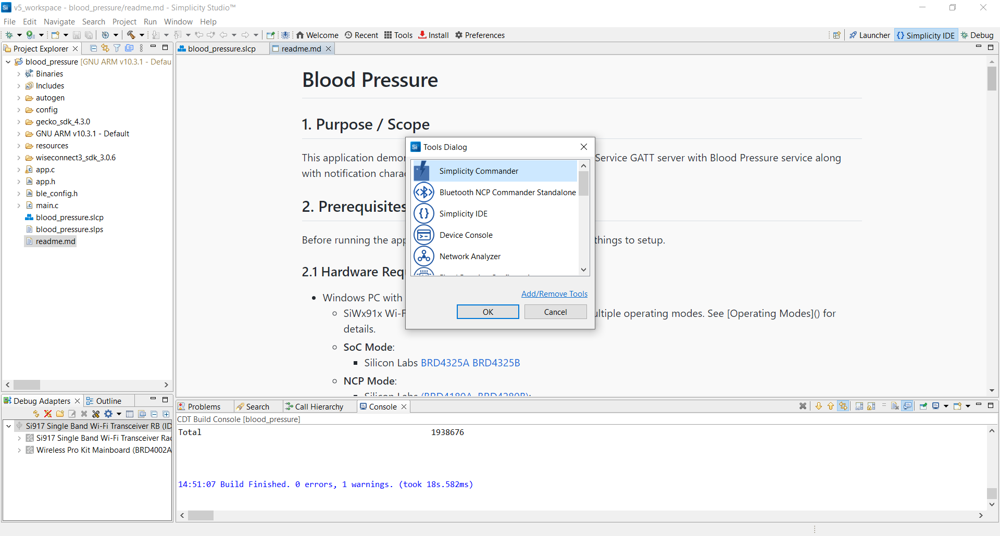

# Blood Pressure 

## 1. Purpose / Scope

This application demonstrates how to configure Blood Pressure Service GATT server with Blood Pressure service along with notification characteristic UUID.

## 2. Prerequisites / Setup Requirements

Before running the application, the user will need the following things to setup.

### 2.1 Hardware Requirements

- Windows PC with Host interface(UART/ SPI/ SDIO).
- SiWx91x Wi-Fi Evaluation Kit. The SiWx91x supports multiple operating modes. See [Operating Modes]() for details.
- **SoC Mode**:
      - Silicon Labs [BRD4325A, BRD4325B, BRD4325C, BRD4325G, BRD4338A](https://www.silabs.com/)
- **NCP Mode**:
      - Silicon Labs [BRD4180B](https://www.silabs.com/);
      - Host MCU Eval Kit. This example has been tested with:
        - Silicon Labs [WSTK + EFR32MG21](https://www.silabs.com/development-tools/wireless/efr32xg21-bluetooth-starter-kit)
        - Silicon Labs [WSTK + EFM32GG11](https://www.silabs.com/development-tools/mcu/32-bit/efm32gg11-starter-kit)  
- BLE peripheral device

#### SoC Mode

  
#### NCP Mode

Follow the [Getting Started with Wiseconnect3 SDK](https://docs.silabs.com/wiseconnect/latest/wiseconnect-getting-started/) guide to set up the hardware connections and Simplicity Studio IDE.

### 2.2 Software Requirements

- [WiSeConnect SDK](https://github.com/SiliconLabs/wiseconnect-wifi-bt-sdk/)

- Simplicity Studio IDE
  - Download the [Simplicity Studio IDE](https://www.silabs.com/developers/simplicity-studio).
  - Follow the [Simplicity Studio user guide](https://docs.silabs.com/simplicity-studio-5-users-guide/1.1.0/ss-5-users-guide-getting-started/install-ss-5-and-software#install-ssv5) to install Simplicity Studio IDE.
- Download and install the Silicon Labs [EFR Connect App](https://www.silabs.com/developers/efr-connect-mobile-app) in the android smart phones for testing BLE applications. Users can also use their choice of BLE apps available in Android/iOS smart phones.

## 3. Project Environment

### 3.1 Project Creation

#### 3.1.1 SoC Mode

1. Ensure the SiWx91x setup is connected to your PC.

- In the Simplicity Studio IDE, the SiWx91x SoC board will be detected under **Debug Adapters** pane as shown below.

   

- Studio should detect your board. Your board will be shown here. Click on the board detected and go to **EXAMPLE PROJECTS & DEMOS** section.  

- Filter for Bluetooth examples from the Gecko SDK added. For this, check the *Bluetooth* checkbox under **Wireless Technology** and select *BLE - Blood Pressure* application.

   

- Click 'Create'. The "New Project Wizard" window appears. Click 'Finish'

  

#### 3.1.2 NCP Mode

1. Ensure the EFx32 and SiWx91x setup is connected to your PC.

- In the Simplicity Studio IDE, the EFR32 board will be detected under **Debug Adapters** pane as shown below.

   

- Ensure the latest Gecko SDK along with the WiSeConnect 3 extension is added to Simplicity Studio.

- Go to the 'EXAMPLE PROJECT & DEMOS' tab and select *BLE - Blood Pressure* application.

- Click 'Create'. The "New Project Wizard" window appears. Click 'Finish'.

  
  
### 3.2 Setup for Application Prints

#### 3.2.1 SoC Mode

  You can use either of the below USB to UART converters for application prints.

1. Setup using USB to UART converter board.

      - Connect Tx (Pin-6) to P27 on WSTK
      - Connect GND (Pin 8 or 10) to GND on WSTK

         ****

2. Setup using USB to UART converter cable.

      - Connect RX (Pin 5) of TTL convertor to P27 on WSTK
      - Connect GND (Pin1) of TTL convertor to GND on WSTK

         ****

**Tera Term setup - for NCP and SoC modes**

1. Open the Tera Term tool.

   - For SoC mode, choose the serial port to which USB to UART converter is connected and click on **OK**.

      ****

   - For NCP mode, choose the J-Link port and click on **OK**.

      ****

2. Navigate to the Setup → Serial port and update the baud rate to **115200** and click on **OK**.

      ****

      ****

## 4. Application Configuration Parameters

The application can be configured to suit your requirements and development environment. Read through the following sections and make any changes needed.

**4.1** Open `app.c` file

**4.1.1** User must update the below parameters

`RSI_BLE_BLOOD_PRESSURE_SERVICE_UUID` refers to the attribute value of the newly created service.

         #define RSI_BLE_BLOOD_PRESSURE_SERVICE_UUID              0x1810

`RSI_BLE_BLOOD_PRESSURE_MEASUREMENT_UUID` refers to the attribute type of the first attribute under this above primary service.

         #define  RSI_BLE_BLOOD_PRESSURE_MEASUREMENT_UUID          0x2A35
`RSI_BLE_INTERMEDIATE_CUFF_PRESSURE_UUID` refers to the attribute type of the second attribute under this above primary service.

         #define  RSI_BLE_INTERMEDIATE_CUFF_PRESSURE_UUID          0x2A36
`RSI_BLE_BLOOD_PRESSURE_FEATURE_UUID` refers to the attribute type of the third attribute under this above primary service.

         #define  RSI_BLE_BLOOD_PRESSURE_FEATURE_UUID              0x2A49

`RSI_BLE_APP_BLOOD_PRESSURE` refers name of the Silicon Labs device to appear during scanning by remote devices.
  
         #define RSI_BLE_APP_BLOOD_PRESSURE                       "BLS"

`GATT_ROLE` refers the role of the Silicon Labs module to be selected.
If user configure `SERVER`, Silicon Labs module will act as GATT SERVER, means will add blood pressure service profile.
If user configure `CLIENT`, Silicon Labs module will act as GATT CLIENT, means will connect to remote GATT server and get services.

         #define GATT_ROLE                                        SERVER

If user configure CLIENT role following macros should be configured.

`RSI_BLE_DEV_ADDR_TYPE` refers address type of the remote device to connect.

         #define  RSI_BLE_INTERMEDIATE_CUFF_PRESSURE_UUID          0x2A36
         RSI_BLE_DEV_ADDR_TYPE                            LE_PUBLIC_ADDRESS

Valid configurations are

         #define 
         LE_RANDOM_ADDRESS
         LE_PUBLIC_ADDRESS

`RSI_BLE_DEV_ADDR` refers address of the remote device to connect.
         #define RSI_BLE_DEV_ADDR                                 "00:1A:7D:DA:71:13"

`RSI_REMOTE_DEVICE_NAME` refers the name of remote device to which Silicon Labs device has to connect

         #define RSI_REMOTE_DEVICE_NAME                           "REMOTE_BLS_DEV"

**Note:**
User can configure either RSI_BLE_DEV_ADDR or RSI_REMOTE_DEVICE_NAME of the remote device.

- Following are the non configurable macros related to attribute properties.

         #define  RSI_BLE_ATT_PROPERTY_READ                        0x02
         #define  RSI_BLE_ATT_PROPERTY_WRITE                       0x08
         #define  RSI_BLE_ATT_PROPERTY_WRITE_WITHOUT_RESP          0x04
         #define  RSI_BLE_ATT_PROPERTY_NOTIFY                      0x10
         #define  RSI_BLE_ATT_PROPERTY_INDICATE                    0x20

**4.1.2**Following are the non-configurable macros in the application.
`RSI_BLE_CHAR_SERV_UUID` refers to the attribute type of the characteristics to be added in a service.

         #define RSI_BLE_CHAR_SERV_UUID                           0x2803
`RSI_BLE_CLIENT_CHAR_UUID` refers to the attribute type of the client characteristics descriptor to be added in a service.

         #define RSI_BLE_CLIENT_CHAR_UUID                         0x2902

Following are the event numbers for advertising, connection and Disconnection events,

         #define  RSI_APP_EVENT_ADV_REPORT                 0x00
         #define  RSI_BLE_CONN_EVENT                       0x01
         #define  RSI_BLE_DISCONN_EVENT                    0x02
         #define  RSI_BLE_GATT_WRITE_EVENT                 0x03
         #define  RSI_BLE_GATT_PROFILE_RESP_EVENT          0x04
         #define  RSI_BLE_GATT_CHAR_SERVICES_RESP_EVENT    0x05
         #define  RSI_BLE_GATT_CHAR_DESC_RESP_EVENT        0x06

2. Open ble_config.h file and update/modify following macros,

         #define RSI_BLE_PWR_INX                                  30 
         #define RSI_BLE_PWR_SAVE_OPTIONS                         BLE_DISABLE_DUTY_CYCLING 

**Note:** `ble_config.h` files are already set with desired configuration in respective example folders user need not change for each example.

## 5. Build and Testing the Application

- Follow the below steps for the successful execution of the application.

### 5.1 Build the Application

- Follow the below steps for the successful execution of the application.

#### SoC Mode

- Once the project is created, click on the build icon (hammer) to build the project (or) right click on project and click on Build Project.

   

- Successful build output will show as below.

#### NCP Mode

   

- Successful build output will show as below.

### 5.2 Loading the Application Image

1. Click on Tools and Simplicity Commander as shown below.

   

2. Load the firmware image
   - Select the board.
   - Browse the application image (.hex) and click on Flash button.

   

### 5.3 Common Steps

**5.3.1** Server role

1. After the program gets executed, Silicon Labs module will be in Advertising state.
2. Open a nRFConnect App and do the scan. (see Figure 2)
3. In the App, Silicon Labs module will appear with the name configured in the macro `RSI_BLE_APP_BLOOD_PRESSURE` (Ex: "BLS") or sometimes observed as Silicon Labs device as internal name "SimpleBLEPeripheral".
4. Initiate connection from the App.
5. After successful connection, nRFConnect displays the supported services of Silicon Labs module.
6. Select the attribute service which is added `RSI_BLE_BLOOD_PRESSURE_SERVICE_UUID` (Ex: 0x1810). (see Figure 3 and 4)
7. Enable Notify for the characteristic `RSI_BLE_BLOOD_PRESSURE_MEASUREMENT_UUID` (Ex: 0x2A35). So that GATT server notifies when value updated in that particular attribute.
8. Silicon Labs module sends the Blood pressure measurement value to the attribute `RSI_BLE_BLOOD_PRESSURE_MEASUREMENT_UUID` (Ex: 0x2A35) of the remote device and will indicate the GATT client (remote device).
9. `RSI_BLE_BLOOD_PRESSURE_FEATURE_UUID` will describe the value by its fields as shown in fig.

Following are the snapshots of smart phone nRFConnert App act as a client and Silicon Labs device as a server.

**5.3.2** Client

1. Advertise a LE device which supports Blood Pressure Service.
2. After the program gets executed, Silicon Labs module will connect to that remote device based on given BD address or name.
3. After successful connection Silicon Labs module will read the services from the remote GATT server.
4. If remote device support notify property Silicon Labs module will enable notify, and ready to receive notifications from remote device.
5. Whenever GATT server changes value and notifies that Silicon Labs module will receive that value.
