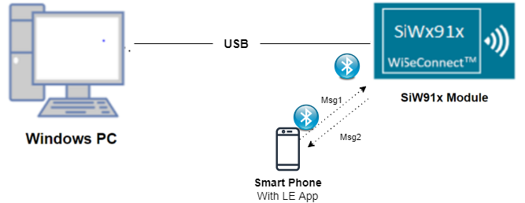
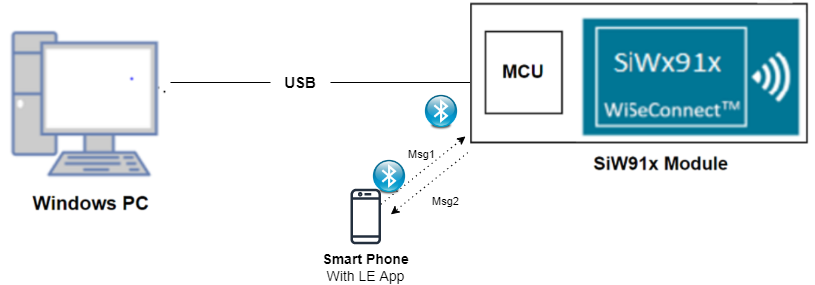
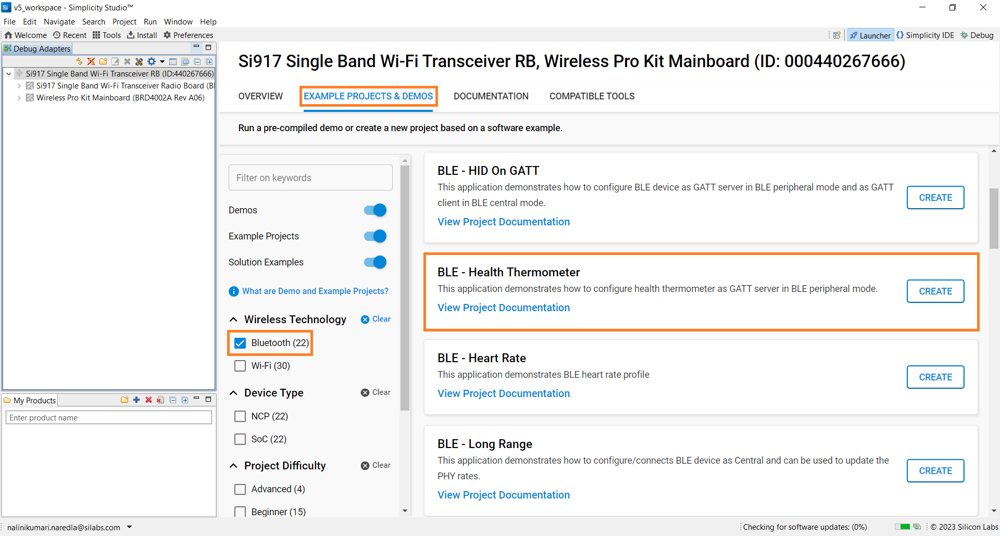
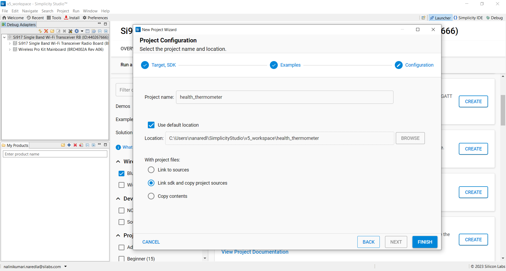
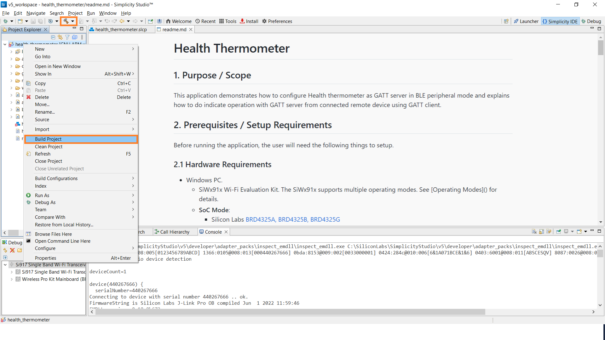
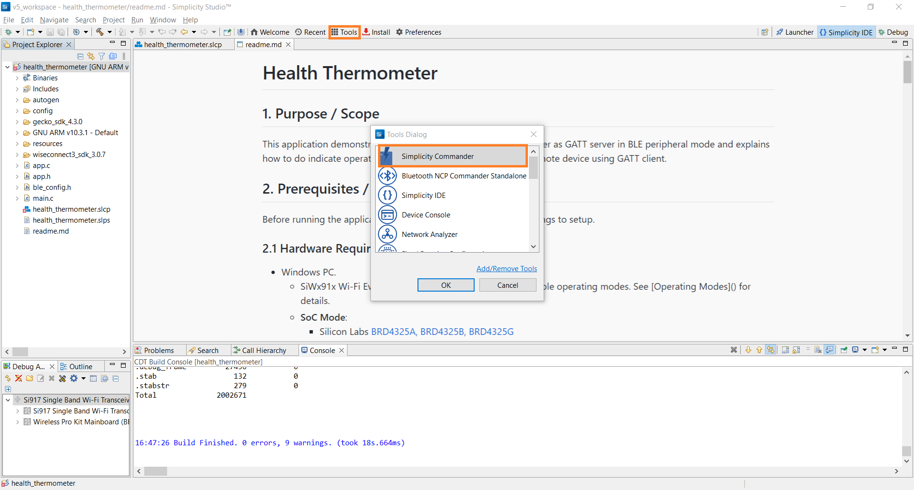
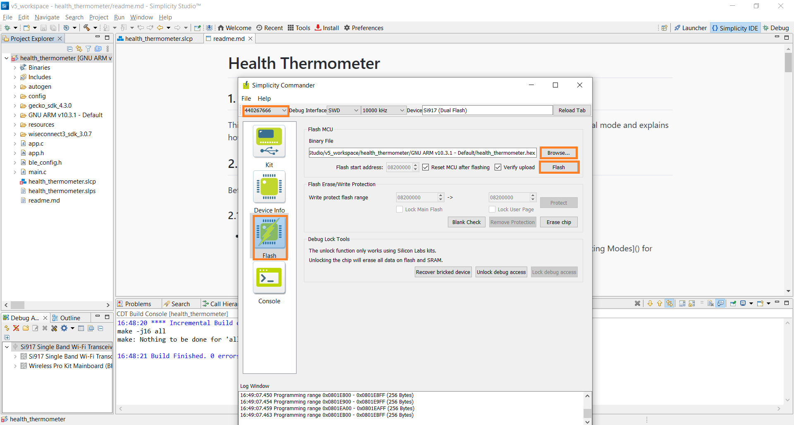
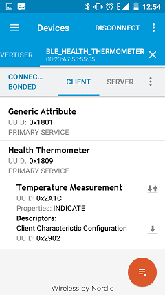
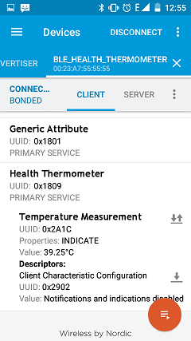
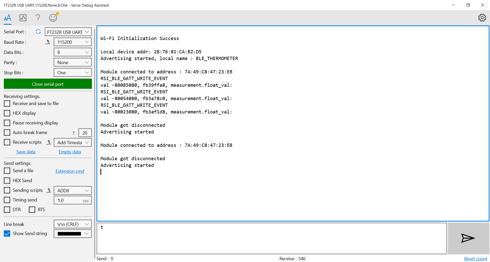

# Health Thermometer

## 1. Purpose / Scope

This application demonstrates how to configure Health thermometer as GATT server in BLE peripheral mode and explains how to do indicate operation with GATT server from connected remote device using GATT client.

## 2. Prerequisites / Setup Requirements

Before running the application, the user will need the following things to setup.

### 2.1 Hardware Requirements

- Windows PC.
- SiWx91x Wi-Fi Evaluation Kit. The SiWx91x supports multiple operating modes. See [Operating Modes]() for details.
- **SoC Mode**:
      - Silicon Labs [BRD4325A, BRD4325B, BRD4325C, BRD4325G, BRD4338A](https://www.silabs.com/)
- **NCP Mode**:
      - Silicon Labs [BRD4180B](https://www.silabs.com/);
      - Host MCU Eval Kit. This example has been tested with:
        - Silicon Labs [WSTK + EFR32MG21](https://www.silabs.com/development-tools/wireless/efr32xg21-bluetooth-starter-kit)
        - Silicon Labs [WSTK + EFM32GG11](https://www.silabs.com/development-tools/mcu/32-bit/efm32gg11-starter-kit)
        - [STM32F411 Nucleo](https://st.com/)  
- BLE peripheral device

#### SOC Mode

  
#### NCP Mode

Follow the [Getting Started with Wiseconnect3 SDK](https://docs.silabs.com/wiseconnect/latest/wiseconnect-getting-started/) guide to set up the hardware connections and Simplicity Studio IDE.

### 2.2 Software Requirements

- [WiSeConnect SDK](https://github.com/SiliconLabs/wiseconnect-wifi-bt-sdk/)

- Embedded Development Environment

- Download the [Simplicity Studio IDE](https://www.silabs.com/developers/simplicity-studio).  

- Follow the [Simplicity Studio user guide](https://docs.silabs.com/simplicity-studio-5-users-guide/1.1.0/ss-5-users-guide-getting-started/install-ss-5-and-software#install-ssv5) to install Simplicity Studio IDE.

- Download and install the Silicon Labs [EFR Connect App](https://www.silabs.com/developers/efr-connect-mobile-app) in the android smart phones for testing BLE applications. Users can also use their choice of BLE apps available in Android/iOS smart phones.

## 3. Project Environment

### 3.1 Project Creation

#### 3.1.1 SoC Mode

1. Ensure the SiWx91x setup is connected to your PC.

- In the Simplicity Studio IDE, the SiWx91x SoC board will be detected under **Debug Adapters** pane as shown below.

   

- Studio should detect your board. Your board will be shown here. Click on the board detected and go to **EXAMPLE PROJECTS & DEMOS** section.

- Filter for Bluetooth examples from the Gecko SDK added. For this, check the *Bluetooth* checkbox under **Wireless Technology** and select *BLE - Health Thermometer* application.

   

- Click 'Create'. The "New Project Wizard" window appears. Click 'Finish'

  

#### 3.1.2 NCP Mode

1. Ensure the EFx32 and SiWx91x setup is connected to your PC.

- In the Simplicity Studio IDE, the EFR32 board will be detected under **Debug Adapters** pane as shown below.

   

- Ensure the latest Gecko SDK along with the WiSeConnect 3 extension is added to Simplicity Studio.

- Go to the 'EXAMPLE PROJECT & DEMOS' tab and select *BLE - Health Thermometer* application.

- Click 'Create'. The "New Project Wizard" window appears. Click 'Finish'.

  

### 3.2 Setup for Application Prints

#### 3.2.1 SoC Mode

  You can use either of the below USB to UART converters for application prints.

1. Setup using USB to UART converter board.

 - Connect Tx (Pin-6) to P27 on WSTK
   - Connect GND (Pin 8 or 10) to GND on WSTK

   ****

2. Setup using USB to UART converter cable.

 - Connect RX (Pin 5) of TTL convertor to P27 on WSTK
   - Connect GND (Pin1) of TTL convertor to GND on WSTK

   ****

**Tera Term setup - for NCP and SoC modes**

1. Open the Tera Term tool.

 - For SoC mode, choose the serial port to which USB to UART converter is connected and click on **OK**.

   ****

 - For NCP mode, choose the J-Link port and click on **OK**.

   ****

2. Navigate to the Setup → Serial port and update the baud rate to **115200** and click on **OK**.

  ****

  ****

## 4. Application Configuration Parameters

The application can be configured to suit your requirements and development environment. Read through the following sections and make any changes needed.

**4.1** Open `app.c` file

**4.1.1** User must update the below parameters

`RSI_BLE_HEALTH_THERMOMETER_UUID` refers to the attribute value of the newly created service.

         #define RSI_BLE_HEALTH_THERMOMETER_UUID                  0x1809

`RSI_BLE_TEMPERATURE_MEASUREMENT_UUID` refers to the attribute type of the first attribute under this service (RSI_BLE_HEALTH_THERMOMETER_UUID).

         #define RSI_BLE_TEMPERATURE_MEASUREMENT_UUID             0x2A1C
`RSI_BLE_TEMPERATURE_TYPE_UUID` refers to the attribute type of the second attribute under this service (RSI_BLE_HEALTH_THERMOMETER_UUID).

         #define RSI_BLE_TEMPERATURE_TYPE_UUID                    0x2A1D 
`RSI_BLE_INTERMEDIATE_TEMPERATURE_UUID` refers to the attribute type of the second attribute under this service (RSI_BLE_HEALTH_THERMOMETER_UUID).

         #define RSI_BLE_INTERMEDIATE_TEMPERATURE_UUID            0x2A1E

`RSI_BLE_MAX_DATA_LEN` refers to the Maximum length of the attribute data.

         #define RSI_BLE_MAX_DATA_LEN                             20

`BLE_HEALTH_THERMOMETER` refers name of the Silicon Labs device to appear during scanning by remote devices.

         #define RSI_BLE_APP_SIMPLE_CHAT                          "BLE_THERMOMETER"

**4.1.2**Following are the non-configurable macros in the application.

`RSI_BLE_CHAR_SERV_UUID` refers to the attribute type of the characteristics to be added in a service.

         #define RSI_BLE_CHAR_SERV_UUID                           0x2803
`RSI_BLE_CLIENT_CHAR_UUID` refers to the attribute type of the client characteristics descriptor to be added in a service.

         #define RSI_BLE_CLIENT_CHAR_UUID                         0x2902

Following are the GATT properties
         #define RSI_BLE_ATT_PROPERTY_READ                        0x02
         #define RSI_BLE_ATT_PROPERTY_WRITE                       0x08
         #define RSI_BLE_ATT_PROPERTY_NOTIFY                      0x10
         #define RSI_BLE_ATT_PROPERTY_INDICATE                    0x20

**4.2** Open `ble_config.h` file and update/modify following macros

         #define RSI_BLE_PWR_INX                                  30 
         #define RSI_BLE_PWR_SAVE_OPTIONS                         BLE_DISABLE_DUTY_CYCLING 

**Note:** `ble_config.h` file is already set with desired configuration in respective example folders user need not change for each example.

## 5. Build and Test the Application

- Follow the below steps for the successful execution of the application.

### 5.1 Build the Application

- Follow the below steps for the successful execution of the application.

#### SoC Mode

- Once the project is created, click on the build icon (hammer) to build the project (or) right click on project and click on Build Project.

   

- Successful build output will show as below.

#### NCP Mode

   

- Successful build output will show as below.

### 5.2 Loading the Application Image

1. Click on Tools and Simplicity Commander as shown below.

   

2. Load the application image
 - Select the board.
 - Browse the application image (.hex) and click on Flash button.

   

### 5.3 Common Steps

1. After the program gets executed, Silicon Labs module will be in Advertising state.

2. Open a LE App in the Smartphone and do the scan.

3. In the App, Silicon Labs module device will appear with the name configured in the macro RSI_BLE_APP_SIMPLE_CHAT (Ex: "BLE_HEALTH_THERMOMETER") or sometimes observed as Silicon Labs device as internal name "SimpleBLEPeripheral".

4. Initiate connection from the App.

5. After successful connection, LE scanner displays the supported services of Silicon Labs module.

6. Select the attribute service which is added RSI_BLE_HEALTH_THERMOMETER_UUID (Ex: 0x1809).

7. Enable Indicate for the characteristic RSI_BLE_TEMPERATURE_MEASUREMENT_UUID (Ex: 0x2A1C). So that GATT server indicates when value updated in that particular attribute.

8. Silicon Labs module sends the health thermometer temperature measurement data to the attribute RSI_BLE_TEMPERATURE_MEASUREMENT_UUID (Ex: 0x2A1C) of the remote device and indicates the GATT client (remote device).

9. Please refer the given below images for indicate operation from remote device GATT client.

10. 4.Refer the below images for console prints

