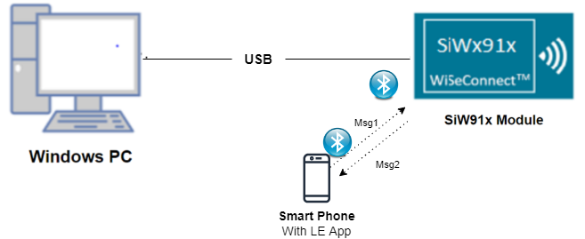
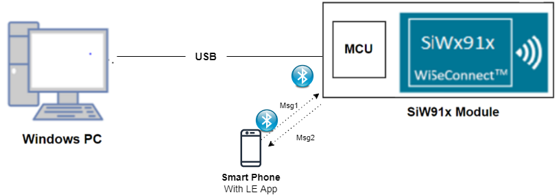
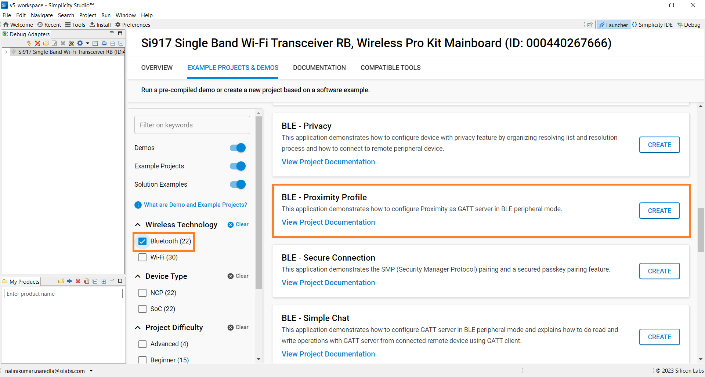
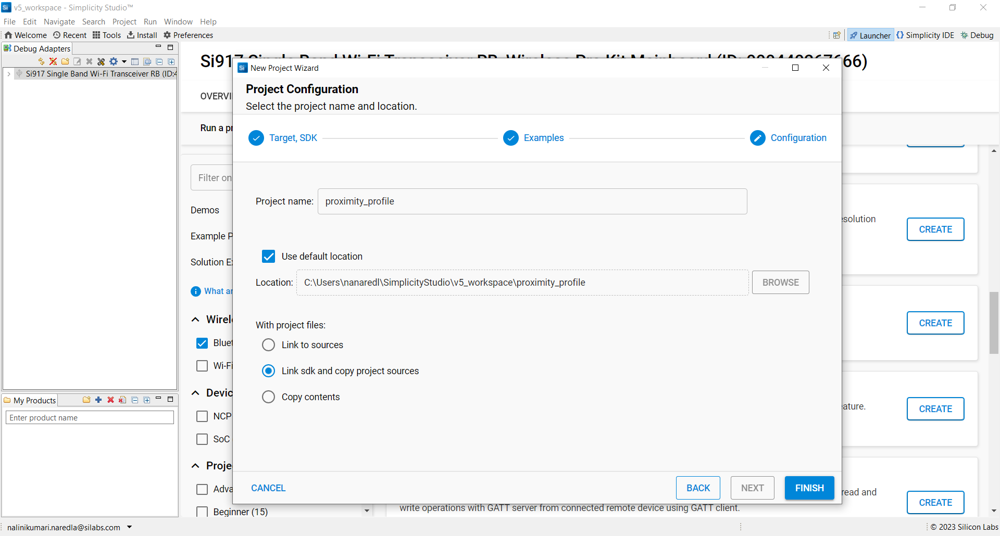
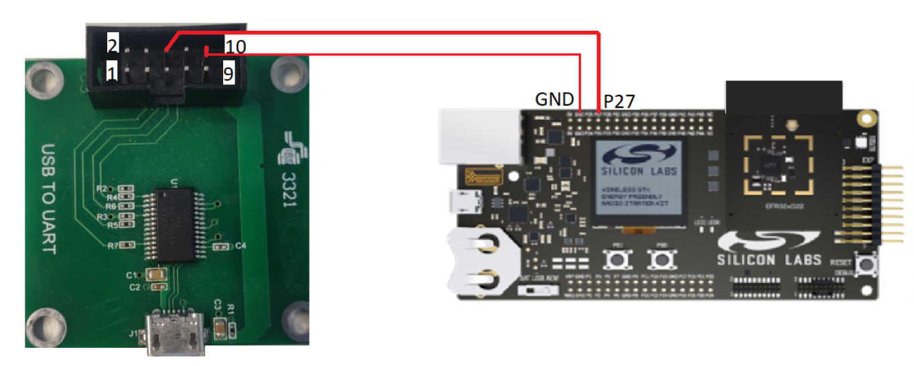
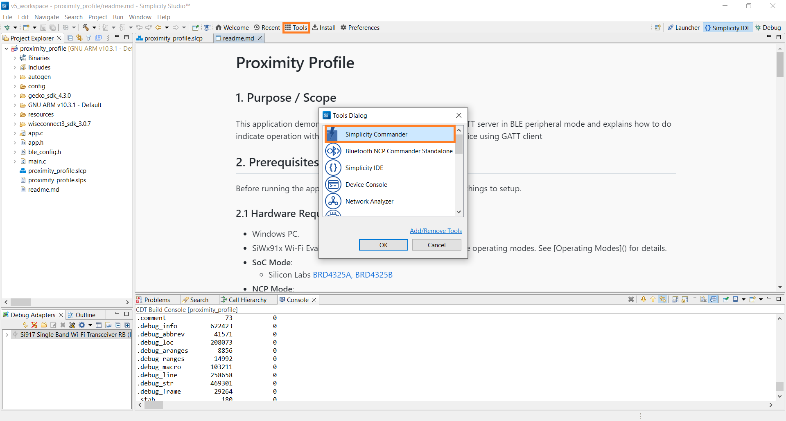
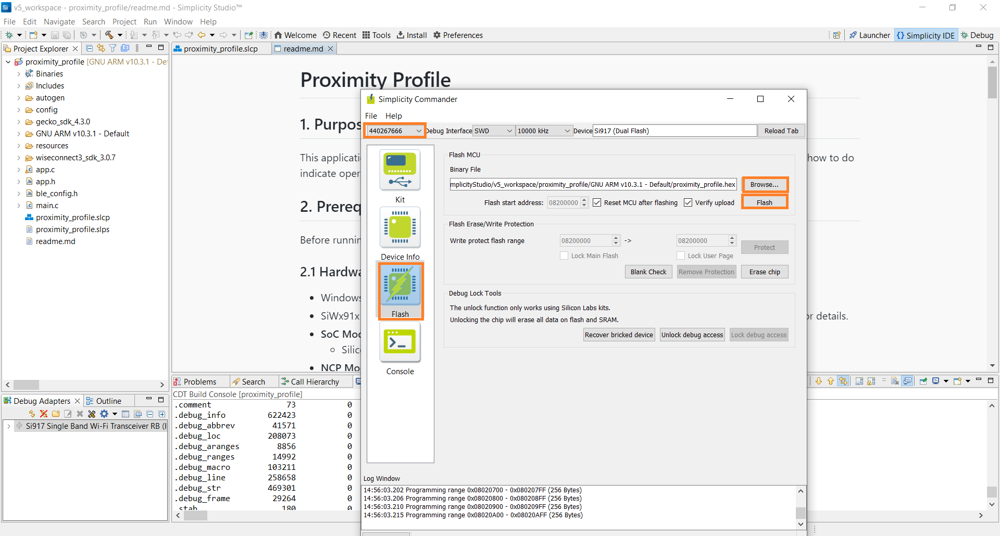
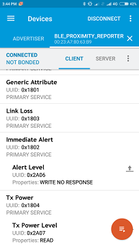
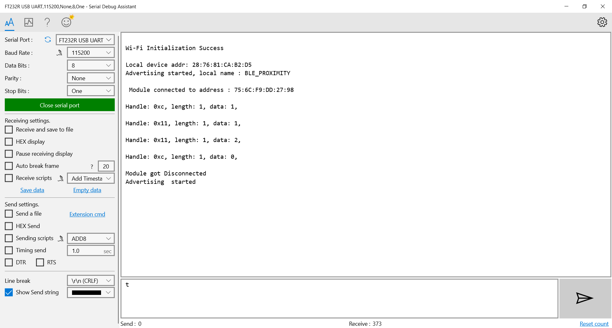

# Proximity Profile

## 1. Purpose / Scope

This application demonstrates how to configure Proximity as GATT server in BLE peripheral mode and explains how to do indicate operation with GATT server from connected remote device using GATT client

## 2. Prerequisites / Setup Requirements

Before running the application, the user will need the following things to setup.

### 2.1 Hardware Requirements

- Windows PC.
- SiWx91x Wi-Fi Evaluation Kit. The SiWx91x supports multiple operating modes. See [Operating Modes]() for details.
- **SoC Mode**:
      - Silicon Labs [BRD4325A, BRD4325B, BRD4325C, BRD4325G, BRD4338A](https://www.silabs.com/)
- **NCP Mode**:
      - Silicon Labs [BRD4180B](https://www.silabs.com/); **AND**
      - Host MCU Eval Kit. This example has been tested with:
      - Silicon Labs [WSTK + EFR32MG21](https://www.silabs.com/development-tools/wireless/efr32xg21-bluetooth-starter-kit)
- BLE peripheral device

#### SOC Mode

  
#### NCP Mode

Follow the [Getting Started with Wiseconnect3 SDK](https://docs.silabs.com/wiseconnect/latest/wiseconnect-getting-started/) guide to set up the hardware connections and Simplicity Studio IDE.

### 2.2 Software Requirements

- [WiSeConnect SDK](https://github.com/SiliconLabs/wiseconnect-wifi-bt-sdk/)

- Embedded Development Environment

- For Silicon Labs EFx32, use the latest version of [Simplicity Studio](https://www.silabs.com/developers/simplicity-studio)

- Download and install the Silicon Labs [EFR Connect App](https://www.silabs.com/developers/efr-connect-mobile-app) in the android smart phones for testing BLE applications. Users can also use their choice of BLE apps available in Android/iOS smart phones.

## 3. Project Environment

### 3.1 Project Creation

#### 3.1.1 SoC Mode

1. Ensure the SiWx91x setup is connected to your PC.

- In the Simplicity Studio IDE, the SiWx91x SoC board will be detected under **Debug Adapters** pane as shown below.

   

- Studio should detect your board. Your board will be shown here. Click on the board detected and go to **EXAMPLE PROJECTS & DEMOS** section.  

- Filter for Bluetooth examples from the Gecko SDK added. For this, check the *Bluetooth* checkbox under **Wireless Technology** and select *BLE - Glucose* application.

   

- Click 'Create'. The "New Project Wizard" window appears. Click 'Finish'

  

#### 3.1.2 NCP Mode

1. Ensure the EFx32 and SiWx91x setup is connected to your PC.

- In the Simplicity Studio IDE, the EFR32 board will be detected under **Debug Adapters** pane as shown below.

   

- Ensure the latest Gecko SDK along with the WiSeConnect 3 extension is added to Simplicity Studio.

- Go to the 'EXAMPLE PROJECT & DEMOS' tab and select *BLE - Glucose* application.

- Click 'Create'. The "New Project Wizard" window appears. Click 'Finish'.

  
  
### 3.2 Setup for Application Prints

#### 3.2.1 SoC Mode

  You can use either of the below USB to UART converters for application prints.

1. Setup using USB to UART converter board.

- Connect Tx (Pin-6) to P27 on WSTK
  - Connect GND (Pin 8 or 10) to GND on WSTK

   ****

2. Setup using USB to UART converter cable.

- Connect RX (Pin 5) of TTL convertor to P27 on WSTK
  - Connect GND (Pin1) of TTL convertor to GND on WSTK

   ****

**Tera Term setup - for NCP and SoC modes**

1. Open the Tera Term tool.

- For SoC mode, choose the serial port to which USB to UART converter is connected and click on **OK**.

   ****

- For NCP mode, choose the J-Link port and click on **OK**.

   ****

2. Navigate to the Setup → Serial port and update the baud rate to **115200** and click on **OK**.

  ****

  ****

## 4. Application Configuration Parameters

The application can be configured to suit your requirements and development environment. Read through the following sections and make any changes needed.

**4.1** Open `app.c` file

**4.1.1** User must update the below parameters

`RSI_BLE_APP_PROXIMITY_REPORTER` refers the name of the RS9116W device to appear during scanning by remote devices.

         #define RSI_BLE_APP_PROXIMITY_REPORTER                   "BLE_PROXIMITY_REPORTER"

Following are the event numbers for advertising, connection and Disconnection events,

         #define RSI_BLE_CONN_EVENT                               0x01
         #define RSI_BLE_DISCONN_EVENT                            0x02
         #define RSI_LINK_LOSS_WRITE_EVENT                        0x03
         #define RSI_BLE_IMME_ALT_WRITE_EVENT                     0x04

2. Open ble_config.h file and update/modify following macros,

         #define RSI_BLE_PWR_INX                                  30 
         #define RSI_BLE_PWR_SAVE_OPTIONS                         BLE_DISABLE_DUTY_CYCLING 

**Note:** ble_config.h file is already set with desired configuration in respective example folders user need not change for each example.

## 5. Build and Test the Application

- Follow the below steps for the successful execution of the application.

### 5.1 Build the Application

#### SoC Mode

- Once the project is created, click on the build icon (hammer) to build the project (or) right click on project and click on Build Project.

   

#### NCP Mode

   

### 5.2 Loading the Application Image

1. Click on Tools and Simplicity Commander as shown below.

   

2. Load the firmware image

- Select the board.
- Browse the application image (.hex) and click on Flash button.

   

### 5.3 Common Steps

1. After the program gets executed, Silicon Labs module will be in Advertising state.
2. Open a LE SCANNER App in the Smartphone and do the scan.

3. In the App, Silicon Labs module will appear with the name configured in the macro RSI_BLE_APP_PROXIMITY_REPORTER(Ex:"BLE_PROXIMITY").

4. Initiate connection from the App.

5. Please refer the given below images for write operation from remote device GATT client and check in our application at write handle.

