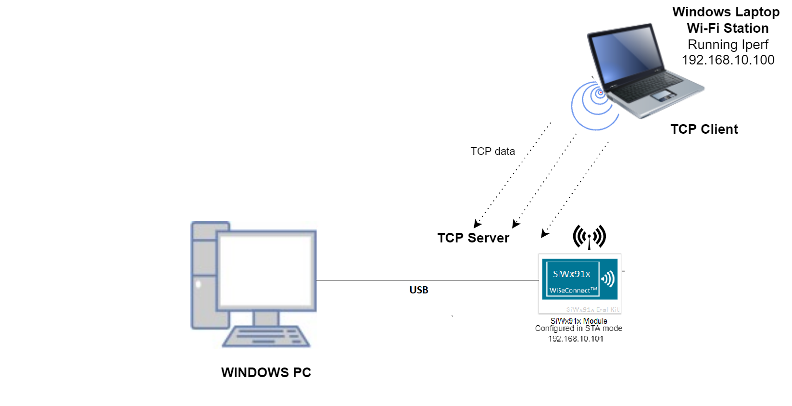
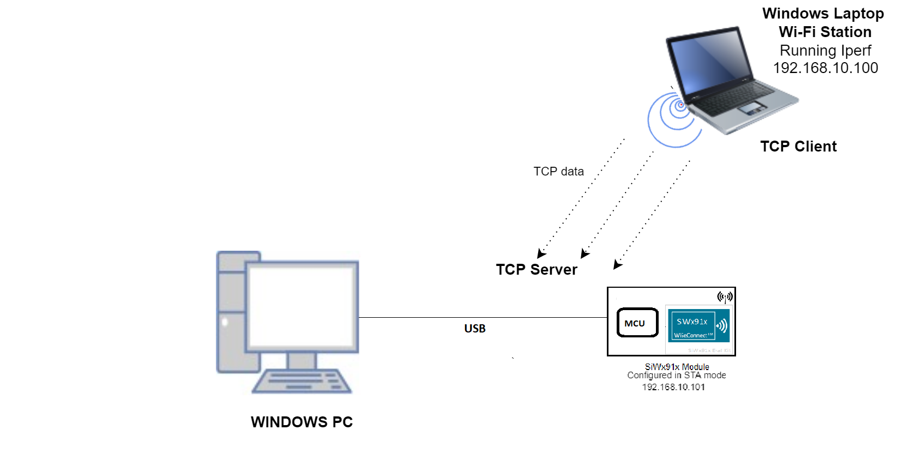
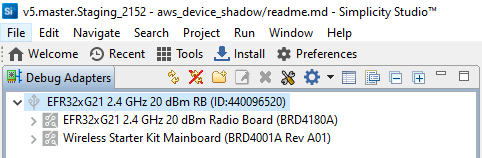
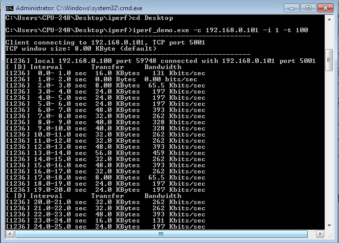
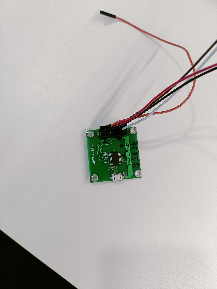

# UDP Client

## 1. Purpose / Scope

This application demonstrates to create an UDP client socket and performs data transfer to remote UDP server.

## 2. Prerequisites / Setup Requirements

Before running the application, set up the following:

### 2.1 Hardware Requirements

- A Windows PC.
- Windows PC (Remote PC) with iperf application
- SiWx91x Wi-Fi Evaluation Kit
  - **SoC Mode**:
    - Silicon Labs [BRD4325A, BRD4325B, BRD4325C, BRD4325G](https://www.silabs.com/)
  - **NCP Mode**:
    - Silicon Labs [BRD4180B](https://www.silabs.com/); **AND**
    - Host MCU Eval Kit. This example has been tested with:
      - Silicon Labs [WSTK + EFR32MG21](https://www.silabs.com/development-tools/wireless/efr32xg21-bluetooth-starter-kit)

#### SoC Mode


  
#### NCP Mode  



## 3. Application Build Environment

### 3.1 Project Setup

Follow the [Getting Started with Wiseconnect3 SDK](https://docs.silabs.com/wiseconnect/latest/wiseconnect-getting-started/) guide to set up the hardware connections and Simplicity Studio IDE.

### 3.2 NCP Mode - Host Interface

- By default, the application is configured to use the SPI bus for interfacing between Host platforms(EFR32MG21) and the SiWx91x EVK.

## 4. Application Configuration Parameters

The application can be configured to suit your requirements and development environment. Read through the following sections and make any changes needed.

**4.1** Configure the following parameters in **rsi_ap_start.c** to enable your Silicon Labs Wi-Fi device to connect to your Wi-Fi network.
  
```c
#define SSID               "SILABS_AP"      // Wi-Fi Network Name
#define PSK                "1234567890"     // Wi-Fi Password
#define SECURITY_TYPE      RSI_WPA2         // Wi-Fi Security Type: RSI_OPEN / RSI_WPA / RSI_WPA2
#define CHANNEL_NO         0                // Wi-Fi channel if the softAP is used (0 = auto select)
```

ENCRYPTION_TYPE refers to the type of Encryption method. Access point supports OPEN, TKIP, CCMP encryption methods.

Valid configurations are:

- RSI_CCMP - For CCMP encryption

- RSI_TKIP - For TKIP encryption

- RSI_NONE - For open encryption

```c
#define ENCRYPTION_TYPE                      RSI_CCMP
```

BEACON_INTERVAL refers to the time delay between two consecutive beacons in milliseconds. Allowed values are integers from 100 to 1000 which are multiples of 100.

```c
#define BEACON_INTERVAL                      100
```

DTIM_INTERVAL refers DTIM interval of the Access Point. Allowed values are from 1 to 255.

```c
#define DTIM_INTERVAL                        4
```

DEVICE_PORT port refers TCP server port number

```c
#define DEVICE_PORT                          5001
```

NUMEBR_OF_PACKETS refers how many packets to receive from remote TCP client.

```c
#define NUMBER_OF_PACKETS                    1000
```

GLOBAL_BUFF_LEN refers the memory length for driver

```c
#define GLOBAL_BUFF_LEN                      15000
```

RECV_BUFFER_SIZE refers receive data length

```c
#define RECV_BUFFER_SIZE                      1000
```

IP address to be configured to the device

```c
#define DEVICE_IP                            "192.168.10.1"
```

IP address of the gateway

```c
#define GATEWAY                              "192.168.10.1"
```

IP address of the network mask

```c
#define NETMASK                              "255.255.255.0"
```

## 5. Testing the Application

Follow the below steps for the successful execution of the application.

### 5.1 Loading the SiWx91x Firmware

Refer [Getting started with a PC](https://docs.silabs.com/rs9116/latest/wiseconnect-getting-started) to load the firmware into SiWx91x EVK. The firmware file is located in `<SDK>/firmware/`

### 5.2 Creating the Project and builing the Application
  
Refer [Getting started with EFX32](https://docs.silabs.com/rs9116-wiseconnect/latest/wifibt-wc-getting-started-with-efx32/), for settin-up EFR & EFM host platforms

#### 5.2.1 Project Creation - SoC Mode

- Connect your board. The Si917 compatible SoC board is **BRD4325A, BRD4325B, BRD4325C, BRD4325G**.
- Studio should detect your board. Your board will be shown here.


#### 5.2.2 Project Creation - NCP Mode

- Connect your board. The supported NCP boards are: **BRD4180B**
- Studio should detect your board. Your board will be shown here.


#### 5.2.3 Selecting an example application and generate project

- Go to the 'EXAMPLE PROJECT & DEMOS' tab and select your desired example application

- Click 'Create'. The "New Project Wizard" window appears. Click 'Finish'


#### 5.2.4 Build Project - SoC Mode

- Once the project is created, right click on project and go to properties → C/C++ Build → Settings → Build Steps
- Add post_build_script_SimplicityStudio.bat file path (SI917_COMBO_SDK.X.X.X.XX\utilities\isp_scripts_common_flash) in build steps settings as shown in below image.

- Check for M4 projects macros in preprocessor settings(RSI_M4_INTERFACE=1)
- Click on the build icon (hammer) to build the project

- Successful build output will show as below.


#### 5.2.5 Build Project - NCP Mode

- Click on the build icon (hammer) to build the project

- Successful build output will show as below.


## 6. Program the device

Once the build was successful, right click on project and click on Debug As->Silicon Labs ARM Program as shown in below image.

### SoC Mode


### NCP Mode 


### 6.1 Running the SiWx91x Application

- After program gets executed, SiWx91x EVK will be created as an Access Point with configured **SSID** ( Ex: "**SILABS_AP"**) and opens TCP server socket on **DEVICE_PORT** and waits for TCP connection request from TCP client. Now scan and connect to Device Access Point (Ex: "SILABS_AP" is the AP name) from Laptop.

- After successful connection, open iperf application from remote PC command Prompt.

- Connect to TCP Server running on SiWx91x EVK using below command

    `iperf.exe -c <DEVICE_IP> -p <DEVICE_PORT> -i 1 -t 100`

- The SiWx91x EVK accepts connection request and receives data on the TCP server port and exit after receiving configured NUMBER_OF_PACKETS



## 7. Observing the output prints on serial terminal

### 7.1 SoC Mode
>
> Connect USB to UART connector Tx and GND pins to WSTK radio board.

- Connect Tx(Pin-6) to P27 on WSTK
- Connect GND(Pin 8 or 10) to GND on WSTK


> Prints can see as below in any Console terminal


### 7.2 NCP Mode

Prints can see as below in any Console terminal


