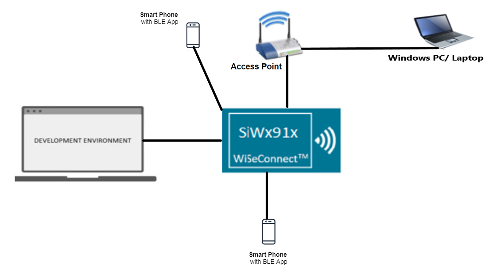

# WLAN HTTPS BLE Dual Role V6

## Table of Contents

- [Purpose/Scope](#purposescope) 
- [Prerequisites/Setup Requirements](#prerequisitessetup-requirements)
  - [Hardware Requirements](#hardware-requirements)
  - [Software Requirements](#software-requirements)
  - [Setup Diagram](#setup-diagram)
- [Getting Started](#getting-started)
- [Application Build Environment](#application-build-environment)
- [Test the Application](#test-the-application)

## Purpose/Scope

This example demonstrates the ability of Si91x connecting and transferring the data simultaneously in BLE/WiFi wireless interfaces. 

In the Coex mode (WiFi+BLE), the module will connect to AP and then download the fixed file from PC acting as Server and supports BLE connection/data transfers simultaneously. 

The Application can be configured for the individual protocol execution as well the combination of protocols execution (WiFi, WiFi+BLE, BLE). Two BLE connections (1 Master and 1 Slave) are supported.

## Prerequisites/Setup Requirements

### Hardware Requirements

- Windows PC
- SoC Mode:
  - Silicon Labs [BRD4325A, BRD4325B, BRD4325C, BRD4325G, BRD4338A](https://www.silabs.com/)
- NCP Mode:
  - Silicon Labs [BRD4180B](https://www.silabs.com/);
  - Host MCU Eval Kit. This example has been tested with:
    - Silicon Labs [WSTK + EFR32MG21](https://www.silabs.com/development-tools/wireless/efr32xg21-bluetooth-starter-kit)
- Smartphone configured as BLE peripheral

### Software Requirements

- Simplicity Studio IDE

- Download and install the Silicon Labs [EFR Connect App or other BLE Central/Peripheral app.](https://www.silabs.com/developers/efr-connect-mobile-app) in the android smart phones for testing BLE applications. Users can also use their choice of BLE apps available in Android/iOS smart phones.

### Setup Diagram


  
## Getting Started

Refer to the instructions [here](https://docs.silabs.com/wiseconnect/latest/wiseconnect-getting-started/) to:

- Install Studio and WiSeConnect 3 extension
- Connect your device to the computer
- Upgrade your connectivity firmware
- Create a Studio project

## Application Build Environment

The application can be configured to suit your requirements and development environment. Read through the following sections and make any changes needed.

**4.1** Open `app_common_config.h` file and configure below macros.

Set below macro to 1 to run **BLE** application

```c
#define RSI_ENABLE_BLE_TEST                          1 //Set this to 0 to disable BLE
```

Set below macro to 1 to run **WLAN** application

```c
#define RSI_ENABLE_WLAN_TEST                         1 //Set this to 0 to disable WLAN
```

> Note: 
> By default, all protocols are enabled.

Choose the required **operational mode** of RS9116W EVK.

> Note:
> By default, opermode is set to WLAN+BLE 

**4.2** Select **BLE** configurations in `ble_config.h` file

To select number of BLE connections, configure below macros.

   Set below macro to required slave connections.

```c
#define RSI_BLE_MAX_NBR_SLAVES                       1
```

   Set below macro to required master connections.

```c
#define RSI_BLE_MAX_NBR_MASTERS                      1
```
   
> Note: 
> Maximum no. of  RSI_BLE_MAX_NBR_MASTERS can be configured to '1' and RSI_BLE_MAX_NBR_SLAVES to '1'.

If CONNECT_OPTION is set to CONN_BY_NAME, configure below macros.

```c
#define CONNECT_OPTION                               CONN_BY_NAME //CONN_BY_NAME or CONN_BY_ADDR
```

To identify remote device with BD Address/device name.

   Add the remote BLE device name to connect

```c
#define RSI_REMOTE_DEVICE_NAME1                      "slave1"
#define RSI_REMOTE_DEVICE_NAME2                      "slave2"
#define RSI_REMOTE_DEVICE_NAME3                      "slave3"
```
   
If CONNECT_OPTION is set to CONN_BY_ADDR, configure the below macros.

Configure the address type of remote device as either Public Address or Random Address

```c
#define RSI_BLE_DEV_ADDR_TYPE                        LE_PUBLIC_ADDRESS //!LE_PUBLIC_ADDRESS or LE_RANDOM_ADDRESS
```

Add the BD Address of remote BLE device to connect

```c
#define RSI_BLE_DEV_1_ADDR                           "88:DA:1A:FE:2A:2C"
#define RSI_BLE_DEV_2_ADDR                           "7E:E6:5E:30:77:6F"
#define RSI_BLE_DEV_3_ADDR                           "70:1A:69:32:7C:8E
```
   
Configure below macros to select the profile characteristics uuid for data transfer. 

```c
#define RSI_BLE_CLIENT_WRITE_SERVICE_UUID_C1             0x180D //! Heart Rate service uuid
#define RSI_BLE_CLIENT_WRITE_CHAR_UUID_C1                0x2A39 //! Heart Rate control Point
#define RSI_BLE_CLIENT_WRITE_NO_RESP_SERVICE_UUID_C1     0x1802 //! Immediate Alert service uuid
#define RSI_BLE_CLIENT_WRITE_NO_RESP_CHAR_UUID_C1        0x2A06 //! Alert level char uuid
#define RSI_BLE_CLIENT_INIDCATIONS_SERVICE_UUID_C1       0x1809 //! Health thermometer Alert service uuid
#define RSI_BLE_CLIENT_INIDCATIONS_CHAR_UUID_C1          0x2A1C //! Temperature measurement
#define RSI_BLE_CLIENT_NOTIFICATIONS_SERVICE_UUID_C1     0x180D //! Heart Rate service uuid
#define RSI_BLE_CLIENT_NOTIFICATIONS_CHAR_UUID_C1        0x2A37 //! Heart Rate measurement 
```
   
Configure below macros to select each connection configurations 

   `Master1 configurations: (where XX=C1)`

Set below macro to enable secure connection between Silicon Labs device(peripheral) and remote ble device(central)

```c
#define SMP_ENABLE_XX               0  //By default, this macro is set to '0' 
```

Set below macro to add remote device to whitelist

```c
#define ADD_TO_WHITELIST_XX         0  //By default, this macro is set to '0' 
```

Set below macro to discover remote profiles.
 
```c
#define PROFILE_QUERY_XX            1  //By default, this macro is set to '1'
```

Set below macro to enable data transfer between devices

```c
#define DATA_TRANSFER_XX            1  //By default, this macro is set to '1'
```

To select the type of data transfer configure below macros

   Set below macro to receive 'gatt notifications' from remote device.

```c
#define RX_NOTIFICATIONS_FROM_XX    0  //By default, this macro is set to '1'
```

> Note:
> Make sure to set below macros to 0.

Set below macro to receive 'gatt indications' from remote device.

```c
#define RX_INDICATIONS_FROM_XX      0  //By default, this macro is set to '0'
```

Set below macro to Transmit 'gatt notifications' to remote device.

```c
#define TX_NOTIFICATIONS_TO_XX      1  //By default, this macro is set to '1'
```

> Note:
> Make sure to set below macros to 0

```c
#define  TX_WRITES_TO_XX            0  //Set this to 0 
#define  TX_WRITES_NO_RESP_TO_XX    0  //Set this to 0 
#define  TX_INDICATIONS_TO_XX       0  //Set this to 0 
```

Set below macro to Transmit 'gatt write with response' to remote device.

```c
#define TX_WRITES_TO_XX             0  //By default, this macro is set to '0' 
```

Set below macro to Transmit 'gatt write without response' to remote device.

```c
#define TX_WRITES_NO_RESP_TO_XX     0  //By default, this macro is set to '0' 
```

Set below macro to Transmit 'gatt indications to remote device.

```c
#define TX_INDICATIONS_TO_XX        0  //By default, this macro is set to '0' 
```

To select data length extension for each connection configure below macro

   Set below macro to enable data length extension

```c
#define DLE_ON_XX                   0  //By default, this macro is set to '0' 
```

Configure below macros to set connection interval, connection latency and connection supervision timeout.

Below configuration is for connection interval of 45ms, latency 0 and timeout as 400ms

```c
#define CONN_INTERVAL_XX            36
#define CONN_LATENCY_XX             0
#define CONN_SUPERVISION_TIMEOUT_XX  400 
```
   
> Note: 
> Follow the above instructions to configure for remaining connections (slave1(XX = P1)

**4.4** Select WLAN configurations in `wifi_app_config.h` file 

Enter the AP Connectivity essential configs as the value to SSID, SECURITY_TYPE and PSK

```c
#define     SSID                    "AP_SSID"
#define     SECURITY_TYPE           SL_WIFI_WPA2 
#define     PSK                     "1234567890"
```

Configure below macro 'CONFIGURE_IPV6' to Select IPV4 or IPV6.
Set  '0' for IPV4 
Set  '1' for IPV6
and also configure 'SERVER_IP_ADDRESS'

```c
#define CONFIGURE_IPV6 0                                       
#define SOCKET_FAMILY     AF_INET6
#define IP_ADDRESS_TYPE   SL_IPV6
#define SERVER_IP_ADDRESS "2402:8100:25c6:73b8:bdf5:347d:454a:1080" //! Server IP address
#else
#define SOCKET_FAMILY     AF_INET
#define IP_ADDRESS_TYPE   SL_IPV4
#define SERVER_IP_ADDRESS "192.168.43.99" //! Server IP address
#endif
```

BY default,  'CONFIGURE_IPV6' is set to 0.

By default the ip gets configured through DHCP

Configure below macros to make Use of Local HTTP server to download the files.

```c
#define   RSI_DNS_CLIENT            0           // set to '1' only if using server name instead of server ip address, by default it is set to '0'
#define   HTTPS_DOWNLOAD            0           // set to '0' to choose HTTP download
#define   SERVER_PORT               80          // by default http runs on port 80
#define   DOWNLOAD_FILENAME         "5MB.txt"   // File to download
#define   CONTINUOUS_HTTP_DOWNLOAD  1           // set to '1' to download continuously, if reset download happens only once.
```

Configure below macros to make Use of Local HTTPS server to download the files.

```c
#define   RSI_DNS_CLIENT            0           // set to '1' only if using server name instead of server ip address, by default it is set to '0'
#define   HTTPS_DOWNLOAD            1           // set to '1' to choose HTTPs download
#define   SERVER_PORT               443         // by default https runs on port 443
#define   DOWNLOAD_FILENAME         "5MB.txt"   // File to download, by default this file is provided in the demo
#define   CONTINUOUS_HTTP_DOWNLOAD  1           // set to '1' to download continuously, if reset download happens only once.
```

> Note:
> BY default, when 'HTTPS_DOWNLOAD' is set, SSL and LOAD_CERTIFICATE will be set to '1' as it is required for HTTPS download.

   > **Note:** The configurations are already set with desired configuration in respective example folders you need not change for each example.

## Test the Application

Refer to the instructions [here](https://docs.silabs.com/wiseconnect/latest/wiseconnect-getting-started/) to:

1. Build the project and flash the binary onto Si91x.

2. Before running below commands, make sure the file configured in 'DOWNLOAD_FILENAME' is present under below path
   
   [File path: `/<SDK>/resources/scripts/`]

3. To download the files from local http server, navigate to below folder and run below command.

   [File path: `/<SDK>/resources/scripts/`] 

   Command for IPv4:
   python simple_http_server.py 80
   
   Command for IPv6:
   python simple_http_server_v6.py 80

4. To download the files from local https server, copy ssl certificates 'server-cert.pem' , 'server-key.pem' from below 'source path' and paste in to 'destination path'.

   [source path: `/<SDK>/resources/certificates/`] 

   [destination path: `/<SDK>/resources/scripts/`] 

     Open command prompt, navigate to above destination path and run below command.

   Command for IPv4:
   openssl s_server -accept 443 -cert server-cert.pem -key server-key.pem -tls1_2 -WWW 

   Command for IPv6:
   openssl s_server -accept 443 -cert server-cert.pem -key server-key.pem -tls1_2 -WWW -6

5. After the program gets executed, module scans for the configured Accesspoint, connects to it and acquires the ip address

6. After acquiring ip address, initiates connection to remote server.(ex: simple_http_server.py running in same network where Module is also connected)

7. If connection is successful,

- Si91x device starts advertising and scanning BLE

- Advertises BT and simultaneoulsy downloads http packets sent from remote server

8. If connection is not successful, step 5 is repeated untill connection is success

9. While downloading is happening, user can initiate both the BT SPP and BLE connections (both peripheral and central).

10. To check BLE peripheral connection, scan and initiate connection from nRF connect/dongles.

11. Si91x accepts the BLE connections if initiated by remote BLE device(max 2 central connections are accepted) and starts data transfer based on the user configuration.

12. To check data transfer, enable Gatt notifications of Module on service characteristic RSI_BLE_ATTRIBUTE_1_UUID

13. If enabled Si91x continuously transmits 20 notifications per connection interval of size 20bytes.

14. To check BLE central connection, advertise the remote ble devices using phone/dongles.

15. Module scans for advertised devices, crosschecks the ble device names/ble device address as configured in application, if matches initiate connection.

16. If BLE connection is successful, Si91x enables the Gatt notifications of remote device for RSI_BLE_CLIENT_NOTIFICATIONS_CHAR_UUID_M1 (Heart Rate measurement) and receives notifications/connection interval.

> Note: 
> Steps 9 to 12 can be repeated for 1 peripheral connection and steps 13 to 15 can be repeated for 1 central connections based on the RSI_BLE_MAX_NBR_CENTRALS and RSI_BLE_MAX_NBR_PERIPHERALS.
