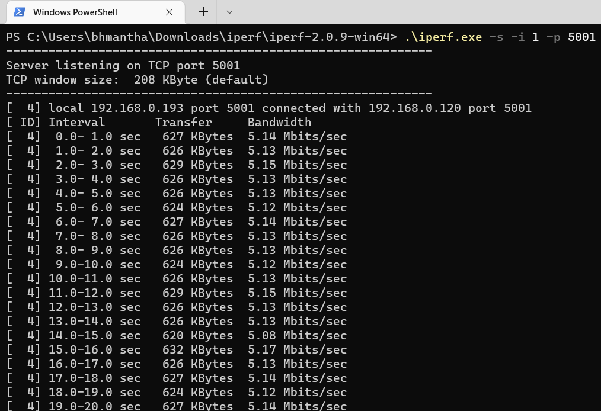
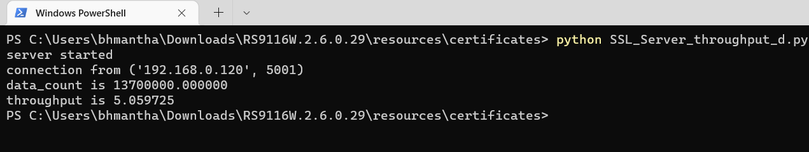

# WLAN Throughput

## Table of Contents

- [Purpose/Scope](#purposescope) 
- [Prerequisites/Setup Requirements](#prerequisitessetup-requirements)
  - [Hardware Requirements](#hardware-requirements)
  - [Software Requirements](#software-requirements)
  - [Setup Diagram](#setup-diagram)
- [Getting Started](#getting-started)
- [Application Build Environment](#application-build-environment)
- [Test the Application](#test-the-application)
  - [Run the UDP Server](#run-the-udp-server)
    - [UDP Tx Throughput](#udp-tx-throughput)
    - [UDP Rx Throughput](#udp-rx-throughput)
    - [TCP Tx Throughput](#tcp-tx-throughput)
    - [TCP Rx Throughput](#tcp-rx-throughput)
    - [TLS Tx Throughput](#tls-tx-throughput)
    - [TLS Rx Throughput](#tls-rx-throughput)
    - [Testing Throughput Steps at Remote System](#testing-throughput-steps-at-remote-system)
  
## Purpose/Scope

This application demonstrates the procedure to measure WLAN UDP/TCP/TLS throughput by configuring the SiWx91x in client/server role.
In this application, the SiWx91x connects to a Wi-Fi access point, obtains an IP address, connects to iPerf server/client or python based TLS scripts, running on a remote PC and measures Tx/Rx throughput transmitted/received from remote PC.

## Prerequisites/Setup Requirements

### Hardware Requirements

- Windows PC
- Wireless Access Point
- **SoC Mode**:
  - Silicon Labs [BRD4325A, BRD4325B, BRD4325C, BRD4325G, BRD4338A](https://www.silabs.com/)
- **NCP Mode**:
  - Silicon Labs [BRD4180B](https://www.silabs.com/)
  - Host MCU Eval Kit. This example has been tested with:
    - Silicon Labs [WSTK + EFR32MG21](https://www.silabs.com/development-tools/wireless/efr32xg21-bluetooth-starter-kit)

### Software Requirements

- Simplicity Studio IDE
- [iPerf Application](https://iperf.fr/iperf-download.php)
- [Python Environment](https://www.python.org/downloads/)

### Setup Diagram

  

## Getting Started

Refer to the instructions [here](https://docs.silabs.com/wiseconnect/latest/wiseconnect-getting-started/) to:

- Install Studio and WiSeConnect 3 extension
- Connect your device to the computer
- Upgrade your connectivity firmware
- Create a Studio project

## Application Build Environment

The application can be configured to suit user requirements and development environment. Read through the following sections and make any changes needed.

**Note:**
  > For NCP mode, following defines have to enabled manually in preprocessor setting of example project
  >
  > - For 917 A0 expansion board, enable `CHIP_917 = 1`
  > - For 917 B0 1.2 expansion board, enable `CHIP_917 = 1`, `CHIP_917B0 = 1`
  > - For 917 B0 2.0 expansion board, enable `CHIP_917 = 1`, `CHIP_917B0 = 1`, `SI917_RADIO_BOARD_V2 = 1` (This is enabled by default for all examples)


- In the Project Explorer pane, expand the **config** folder and open the **sl_net_default_values.h** file. Configure the following parameters to enable your Silicon Labs Wi-Fi device to connect to your Wi-Fi network

- STA instance related parameters

  - DEFAULT_WIFI_CLIENT_PROFILE_SSID refers to the name with which Wi-Fi network that shall be advertised and Si91X module is connected to it.

    ```c
    #define DEFAULT_WIFI_CLIENT_PROFILE_SSID               "YOUR_AP_SSID"      
    ```

  - DEFAULT_WIFI_CLIENT_CREDENTIAL refers to the secret key if the Access point is configured in WPA-PSK/WPA2-PSK security modes.

      ```c
      #define DEFAULT_WIFI_CLIENT_CREDENTIAL                 "YOUR_AP_PASSPHRASE" 
      ```

  - DEFAULT_WIFI_CLIENT_SECURITY_TYPE refers to the security type of the Access point. The supported security modes are mentioned in `sl_wifi_security_t`.

      ```c
      #define DEFAULT_WIFI_CLIENT_SECURITY_TYPE               SL_WIFI_WPA2
      ```

- Other STA instance configurations can be modified if required in `default_wifi_client_profile` configuration structure.

- Configure the following parameters in `app.c` to test throughput app as per requirements

  - Client/Server IP Settings

      ```c
      #define LISTENING_PORT     <local_port>       // Local port to use
      #define SERVER_PORT        <remote_port>      // Remote server port
      #define SERVER_IP_ADDRESS  "192.168.0.100"    // Remote server IP address
      #define SOCKET_ASYNC_FEATURE 1                // Type of Socket used. Synchronous = 0, Asynchronous = 1
      ```

  - Throughput Measurement Types

    - The application may be configured to measure throughput using UDP, TCP or TLS packets. Choose the measurement type using the `THROUGHPUT_TYPE` macro.

      ```c
      #define THROUGHPUT_TYPE  TCP_TX     // Selects the throughput option

      #define TCP_TX           0   // SiWx91x transmits packets to remote TCP client
      #define TCP_RX           1   // SiWx91x receives packets from remote TCP server
      #define UDP_TX           2   // SiWx91x transmits packets to remote UDP client
      #define UDP_RX           3   // SiWx91x receives packets from remote UDP server
      #define TLS_TX           4   // SiWx91x transmits packets to remote TLS server
      #define TLS_RX           5   // SiWx91x receives packets from remote TLS server
      ```

  - Throughput Test options

      ```c
      #define BYTES_TO_SEND     (1 << 29)     // To measure TX throughput with 512MB data transfer
      #define BYTES_TO_RECEIVE  (1 << 20)     // To measure RX throughput with 1MB data transfer
      #define TEST_TIMEOUT      10000         // Throughput test timeout in ms
      ```
  - In the Project explorer pane, expand as follows **wiseconnect3_sdk_xxx** > **components** > **si91x** > **inc** folder and open **sl_si91x_protocol_types.h** file. Change the PLL_MODE to 1, in sl_si91x_socket_constants.h

      ```c
      #define PLL_MODE      1
      ```
      
  - Configure the TCP RX window size and TCP RX window division factor to 44 in the socket configuration in **app.c** to achieve high throughput for TCP_RX and TLS_RX 
   
    ```c
    static sl_si91x_socket_config_t socket_config = {
      1,  // Total sockets
      1,  // Total TCP sockets
      0,  // Total UDP sockets
      0,  // TCP TX only sockets
      1,  // TCP RX only sockets
      0,  // UDP TX only sockets
      0,  // UDP RX only sockets
      1,  // TCP RX high performance sockets
      44, // TCP RX window size
      44  // TCP RX window division factor
    };
    ```  
### Test the application

Refer to the instructions [here](https://docs.silabs.com/wiseconnect/latest/wiseconnect-getting-started/) to:

- Build the Wi-Fi - Throughput (SOC) or Wi-Fi - Throughput (NCP) example in Studio depending on your mode (SoC / NCP).
- Flash, run and debug the application.

  > **Note:** The SiWx91x, which is configured as a UDP/TCP/TLS server/client, connects to the iPerf server/client and sends/receives data for configured intervals. While module is transmitting/receiving the data, application prints the throughput numbers in serial console.

  

#### Run the UDP Server

##### UDP Tx Throughput

To measure UDP Tx throughput, configure the SiWx91x as a UDP client and start a UDP server on the remote PC.
The iPerf command to start the UDP server on the PC is:

  > `C:\> iperf.exe -s -u -p <SERVER_PORT> -i 1`
  >
  > For example ...
  >
  > `C:\> iperf.exe -s -u -p 5001 -i 1`

  

##### UDP Rx Throughput

To measure UDP Rx throughput, configure the SiWx91x as a UDP server and start a UDP client on the remote PC.
The iPerf command to start the UDP client is:

  > `C:\> iperf.exe -c <Module_IP> -u -p <Module_Port> -i 1 -b <Bandwidth> -t <time interval in seconds>`
  >
  > For example ...
  >
  > `C:\> iperf.exe -c 192.168.0.100 -u -p 5001 -i 1 -b 50M -t 30`  

  

##### TCP Tx Throughput

To measure TCP Tx throughput, configure the SiWx91x as a TCP client and start a TCP server on the remote PC.
The iPerf command to start the TCP server is:
  
  > `C:\> iperf.exe -s -p <SERVER_PORT> -i 1`
  >
  > For example ...
  >
  > `C:\> iperf.exe -s -p 5001 -i 1`

  

##### TCP Rx Throughput

To measure TCP Rx throughput, configure the SiWx91x as TCP server and start a TCP client on the remote PC.
The iPerf command to start the TCP client is:

  > `C:\> iperf.exe -c <Module_IP> -p <module_PORT> -i 1 -t <time interval in sec>`
  >
  > For example ...
  >
  > `C:\> iperf.exe -c 192.168.0.100 -p 5001 -i 1 -t 30`  

  

##### TLS Tx Throughput

To measure TLS Tx throughput, configure the SiWx91x as a TLS client and start a TLS server on the remote PC as described in the following bullets:

- Copy the `SSL_Server_throughput_d.py` script from the release `/resources/scripts/` directory to the `/resources/certificates/` directory
- Open a command prompt and cd to the folder `/resources/certificates/`, then run the following command:
  - `C:\> python SSL_Server_throughput_d.py`

    > **Note:** The SSL_Server_throughput_d.py script works only with Python version 2 and above.

  

##### TLS Rx Throughput

To measure TLS RX throughput, configure the SiWx91x as a TLS client and open a TLS server on the remote PC as described in the following bullets:

- Copy the `SSL_tx_throughput.py` script from the release `/resources/scripts/` directory to the `/resources/certificates/`
- Open a command prompt and cd to the folder `/resources/certificates/`, then run the following command:
  - `C:\> python SSL_tx_throughput.py`

    > **Note:** The SSL_tx_throughput.py script works only with Python version 2 and above.

    

- The SiWx91x, which is configured as a UDP/TCP/TLS server/client, connects to the iperf server/client and sends/receives data for configured intervals. While module is transmitting/receiving the data, application prints the throughput numbers in serial console.