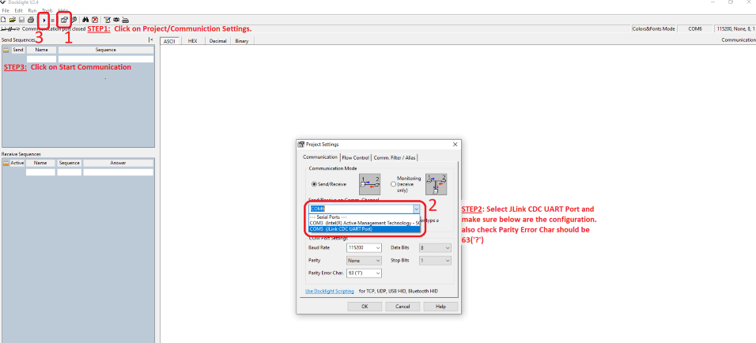
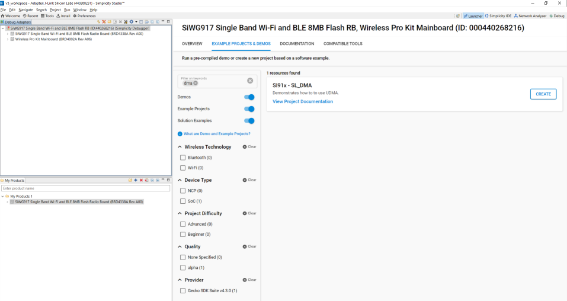

# DMA

## Introduction

- This DMA example performs memory to memory DMA transfer of different sizes. User can change the DMA transfer size by updating SL_DMA_TRANSFER_SIZE in UC.
- This example used both simple DMA transfer API and generic API for performing DMA transfer

## Overview

- DMA is used for performing transfers without processor intervention.
- Si91x DMA supports 3 types of DMA transfers. They are memory to memory, peripheral to memory, memory to peripheral
- UDMA0 supports 32 channels. Out of which last 24 are dedicated channels for particular peripherals. First 8 channels can support 32 different peripherals.
- The number of transfers in a single DMA cycle can be programmed from 1 to 1024
- The transfer address increment can be greater than the data width
- UDMA1 only supports 12 channels

## About Example Code

- \ref dma_example.c file demonstrates how to use DMA peipheral to perform memory to memory transfers
- In this example first dma initialization is done using \ref sl_si91x_dma_init
- Then \ref sl_si91x_dma_allocate_channel is used to allocate SL_DMA_CHANNEL for transfer. This SL_DMA_CHANNEL can be configured
  by UC
- After configuring channel, callbacks are registered using \ref sl_si91x_dma_register_callbacks
- In this example DMA transfer can be initiated by two methods,
  1.  Using \ref sl_si91x_dma_simple_transfer, user can quickly perform DMA transfer using bare minimum configurations.
  2.  Using \ref sl_si91x_dma_transfer, user can configure more DMA parameters for transfer
- User can either use any of above functions for performing DMA transfer. This can be selected by UC

## Running Example Code

- To use this application following Hardware, Software and the Project Setup is required.

### Hardware Requirements

- Windows PC
- Silicon Labs Si917 Evaluation Kit [WPK + BRD4338A]

### Software Requirements

- Si91x SDK
- Embedded Development Environment
  - For Silicon Labs Si91x, use the latest version of Simplicity Studio (refer **"Download and Install Simplicity Studio"** section in **getting-started-with-siwx917-soc** guide at **release_package/docs/index.html**)

### VCOM Setup
- The Serial Console tool's setup instructions are provided below..

## Project Setup

- **Silicon Labs Si91x** refer **"Download SDK"** section in **getting-started-with-siwx917-soc** guide at **release_package/docs/index.html** to work with Si91x and Simplicity Studio.

## Loading Application on Simplicity Studio

1. With the product Si917 selected, navigate to the example projects by clicking on Example Projects & Demos
   in simplicity studio and click on to ULP_TIMER Example application as shown below.

## Configuration and Steps for Execution:

- Open **sl_si91x_dma.slcp** project file select **software component**tab and search for **SL_DMA** in search bar.
- Select DMA instance 0 or 1
- Select the DMA channel used for transfer (1 - 32).
- Select DMA transfer size in bytes (0 - 10000).
- Select transfer API type (simple/generic transfer API).

## Build

1. Compile the application in Simplicity Studio using build icon.

## Device Programming

- To program the device ,refer **"Burn M4 Binary"** section in **getting-started-with-siwx917-soc** guide at **release_package/docs/index.html** to work with Si91x and Simplicity Studio.

## Executing the Application

1. Compile and run the application.

## Expected Results

- Following prints should appear on console
  UDMA Initialization Success

Channel Allocated successfully

Callbacks registered

Xfer start

Transfer completed successfully

UDMA Uninitialization Success

## Note

- The debug feature of Simplicity Studio will not work after M4 flash is turned off.
- To check Prints for DMA Peripheral examples, VCOM of the WPK[BRD4002A]/WSTK[BRD4001A] Base Board.

## Expected Scenario:

- Following prints should appear on console
  UDMA Initialization Success

Channel Allocated successfully

Callbacks registered

Xfer start

Transfer completed successfully

UDMA Uninitialization Success
