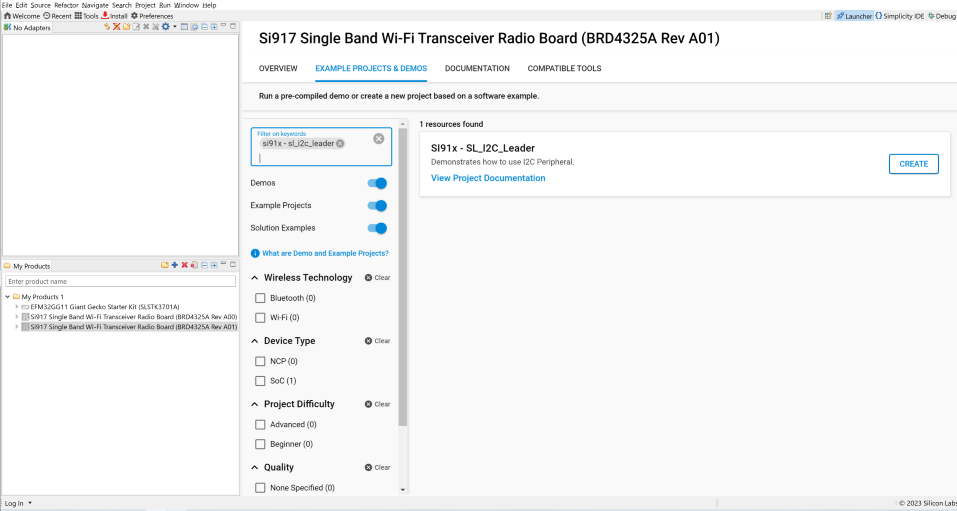

# I2C LEADER
## Introduction

- Note: The master-slave terminology is now replaced with leader-follower. Master is now recognized as Leader and slave is now recognized as Follower.
- This application demonstrates the I2C will be configured in leader mode. The SCL and SDA lines of leader controller are connected to Follower's SCL and SDA pins.
- Same data is transferred from leader to follower and then follower to leader. After transmission the data is compared and result is printed on the console.

## Overview

- There are four I2C Master/Slave controllers - two in the MCU HP peripherals (I2C1, I2C2), one in the NWP/security subsystem and one in the MCU ULP subsystem (ULP_I2C).
- The I2C interface allows the processor to serve as a leader or follower on the I2C bus.
- I2C can be configured with following features
  - I2C standard compliant bus interface with open-drain pins
  - Configurable as Leader or Follower
  - Four speed modes: Standard Mode (100 kbps), Fast Mode (400 kbps), Fast Mode Plus (1Mbps) and High-Speed Mode (3.4 Mbps)
  - 7 or 10-bit addressing and combined format transfers
  - Support for Clock synchronization and Bus Clear

## About Example Code

- This example code demonstrates I2C data transfer between leader and follower either using interrupt(Blocking application) or using DMA (Non-blocking application).
- In example code, first i2c instance is initialized using \ref sl_i2c_driver_init to configure various init structure parameters.
- This structure includes:
  - \ref sl_i2c_operating_mode_t bus speed, it can be Standard, Fast, Fast plus or High speed.
  - \ref sl_i2c_mode_t mode, it should be leader mode for leader application.
  - \ref sl_i2c_transfer_type_t, using interrupt or DMA (for using non-blocking send/tranfer API it should be set as DMA type and for blocking API 
     it should be interrupt type)
  - \ref sl_i2c_callback_t , I2C callback
 - It also initializes I2C clock and configures I2C SDA & SCL pins.
 - It also initializes DMA, if transfer type is 'Using DMA'.
- Now transmit and receive FIFO threshold values are configured using \ref sl_i2c_driver_configure_fifo_threshold API.
- Now write_buffer is filled with some data which needs to be sent to the follower.
- Current_mode enum is set to SEND_DATA and it callls send_data API to send data to follower & configures follower address through \ref sl_i2c_driver_send_data_blocking (for blocking Application) or through \ref sl_i2c_driver_send_data_non_blocking (for Non-blocking Application).
- After that it will wait till all the data is transferred to the follower device.
- Once the i2c callback function sets transfer_complete flag, it changes current_mode enum to RECEIVE_DATA.
- Then it receives data from follower through \ref sl_i2c_driver_receive_data_blocking (for blocking Application) or through \ref sl_i2c_driver_receive_data_non_blocking (for Non-blocking Application).
- After calling receive_data, it will wait till all the data is received from the follower device.
- Once the i2c callback function sets transfer_complete flag, it changes current_mode enum to TRANSMISSION_COMPLETED.
- Now it compares the data which is received from the follower device to the data which it has sent.
- If the data is same, it will print Test Case Passed on the console.

### Note-
- I2C has three instances. User can handle these i2c-instances by adding their instances.
- I2C0, I2C1 & I2C2 are the names pre-defined for the I2C instances
- For user defined instances, one may have to define his hardware specific definitions in config.h file.
- User can directly use APIs in application by passing appropriate structure members, if user doesn't want to configure from UC.

## Running Example Code

- To use this application following Hardware, Software and the Project Setup is required

### Hardware Requirements

- Windows PC
- Silicon Labs [Si917 Evaluation Kit WSTK/WPK + BRD4338]


### Software Requirements

- Si91x SDK
- Embedded Development Environment
  - For Silicon Labs Si91x, use the latest version of Simplicity Studio (refer **"Download and Install Simplicity Studio"** section in **getting-started-with-siwx917-soc** guide at **release_package/docs/index.html**)

## Project Setup

- **Silicon Labs Si91x** refer **"Download SDKs"**, **"Add SDK to Simplicity Studio"**, **"Connect SiWx917"**, **"Open Example Project in Simplicity Studio"** section in **getting-started-with-siwx917-soc** guide at **release_package/docs/index.html** to work with Si91x and Simplicity Studio

## Loading Application on Simplicity Studio

1. With the product Si917 selected, navigate to the example projects by clicking on Example Projects & Demos
   in simplicity studio and click on to i2c leader Example application as shown below.



## Configuration and Steps for Execution
- Open **sl_si91x_i2c_driver_leader.slcp** project file select **software component**tab and search for **i2c** in search bar.
- Click on **I2C0** and configure the I2C0 instance as per configuration parameters given in wizard.
- For using any other I2C instance user has to add that I2C instance by clicking on **I2C Instance** from configuration wizard and then clicking on **Add New Instance**
- For creating I2C instances write 'I2C0', 'I2C1' or 'I2C2' on the wizard for respective instance and then click on **Done**
- After creation of instances seperate configuration files are get generated in **config folder**.
- If project built without selecting configurations, it will take default values from UC.
- Configure mode, operating-mode and transfer-type of I2C instance using respective instance UC.
- Change 'Mode' to 'Leader mode' on UC.
- Change 'Operating Mode' as per bus-speed requirement.
- Change 'Transfer Type' to 'Using Interrupt' for Blocking Application or to 'Using DMA' for NON-Blocking Application.
- After above UC configurations also configure following macros in i2c_leader_example.c file and update/modify following macros if required.
```C
 #define I2C_INSTANCE_USED        // Update it with i2c instance number used for this application: 0 for i2c0, 1 for i2c1 and 2 for i2c2
 #define BLOCKING_APPLICATION     // Enable it for enabling I2C transfer using interrupt Application
 #define NON_BLOCKING_APPLICATION // Enable it for enabling I2C transfer using interrupt Application
 #define FOLLOWER_I2C_ADDR        // Update I2C follower address
 #define SIZE_BUFFERS             // To change the number of bytes to send and receive.Its value should be less than maximum buffer size macro value.
```
- Note: Enable either BLOCKING application or NON-BLOCKING application macro, at a time.
- Change the value of following macros in config/RTE_Device.h
```c
  #define RTE_I2C0_SCL_PORT_ID 0   // SCL pin port id

  #define RTE_I2C0_SDA_PORT_ID 0   //SDA pin port id
```
- After above configurations connect SCL and SDA pins of Leader and follower then run the application and observe the results by connecting SDA and SCL pins to logic Analyzer(Also enable glitch filter for SCL channel with time period 100ns, to avoid gliches).

## Build

1. Compile the application in Simplicity Studio using build icon


## Device Programming

- To program the device ,refer **"Burn M4 Binary"** section in **getting-started-with-siwx917-soc** guide at **release_package/docs/index.html** to work with Si91x and Simplicity Studio

## Executing the Application

1. Compile and run the application.
2. Connect SCL and SDA pins with the follower device.
3. When the application runs, it sends and receives data.
4. After the transfer is completed, it validates the data and prints on the console.

## Expected Results

- Will get "Test Case Passed" print on console
- Sends and recieves 255 bytes of data (1 to 255) for blocking and non-blocking Application.
- Connect Analyzer channels to respective I2C instance SDA & SCA pins to observe the data on lines.