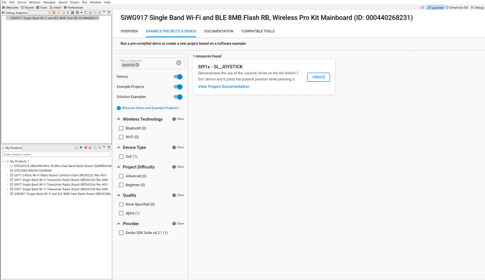

# SL Joystick

This sample app demonstrates the use of the Joystick Driver. It prints the joystick position after every finite interval over the virtual COM serial port (VCOM). VCOM can be used either over USB or by connecting to port 4902 if the kit is connected via Internet.

## Setting Up 
 - To use this application following Hardware, Software and the Project Setup is required

### Hardware Requirements 	
  - Windows PC 
  - The Wireless Pro Kit (BRD4002A) must be used as the mainboard to mount and connect the compatible radio board.
  - Silicon Labs [Si917 Evaluation Kit WPK/WSTK + BRD4338A]
 

### Software Requirements
  - Si91x SDK
  - Embedded Development Environment
    - For Silicon Labs Si91x, use the latest version of Simplicity Studio (refer **"Download and Install Simplicity Studio"** section in **getting-started-with-siwx917-soc** guide at **release_package/docs/index.html**)
 
## Project Setup
- **Silicon Labs Si91x** refer **"Download SDKs"**, **"Add SDK to Simplicity Studio"**, **"Connect SiWx917"**, **"Open Example Project in Simplicity Studio"** section in **getting-started-with-siwx917-soc** guide at **release_package/docs/index.html** to work with Si91x and Simplicity Studio

### VCOM Setup

- The Docklight tool's setup instructions are provided below..

## Loading Application on Simplicity Studio

1. With the product Si917 selected, navigate to the example projects by clicking on Example Projects & Demos
   in simplicity studio and click on to SI91x - SL_JOYSTICK application as shown below.

## Configuration and Steps for Execution

- Configure UC from the slcp component.
- Open **sl_si91x_joystick.slcp** project file select **software component** tab and search for **joystick** in search bar.
- Using configuration wizard one can configure different parameters like:
  - **Joystick Voltage value Configuration**
  - REFERENCE_VOLTAGE: Vref magnitude expressed in millivolts. As per Joystick Hardware on Wireless Pro Kit, Vref = AVDD = 3300 mV.
  - JOYSTICK_MV_C: Center position value(mV).
  - JOYSTICK_MV_N: North/Up position value(mV).
  - JOYSTICK_MV_S: South/Down position value(mV).
  - JOYSTICK_MV_E: East/Right position value(mV).
  - JOYSTICK_MV_W: West/Left position value(mV).
  - JOYSTICK_MV_ERR_CARDINAL_ONLY:Joystick error mV value for Cardinal Directions only.
  
## Joystick on BRD4002A
1. Image shows Joystick located on BRD4002A, position/direction to press the Joystick and pin for Joystick.

## Build 
1. Compile the application in Simplicity Studio using build icon 

## Device Programming
- To program the device ,refer **"Burn M4 Binary"** section in **getting-started-with-siwx917-soc** guide at **release_package/docs/index.html** to work with Si91x and Simplicity Studio

## Executing the Application

1. Compile and run the application.
2. Connect GPIO_26 [P36] (Joystick pin) to ULP_GPIO_8 [P15] for ADC channel input voltage.
3. Press the Joystick on WPK at any direction (Center, North/Up, South/Down, East/Right, West/Left).

## Expected Results

- The application should print the pressed position/direction of joystick in console through vcom connection.
