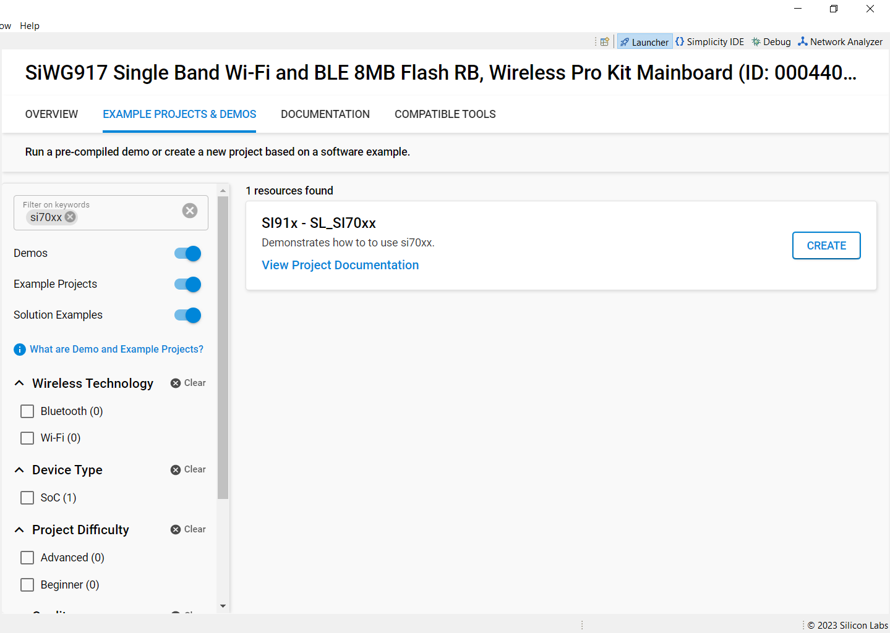

# Si70xx - RHT Sensor

## Introduction

- This application demonstrate the si70xx RHT sensor, which measures the relative humidity and temperature via I2C interface for every 2 seconds.

## Overview

## About Example Code

- This example demonstrates the measurement of relative humidity and temperature for every 2 seconds. Also shows how to use different APIs present via I2C interface.

## Running Example Code

- To use this application following Hardware, Software and the Project Setup is required.

### Hardware Requirements

- Windows PC
- Silicon Labs [Si917 Evaluation Kit WPK/WSTK + BRD4338A]


### Software Requirements

- Si91x SDK
- Embedded Development Environment
  - For Silicon Labs Si91x, use the latest version of Simplicity Studio (refer **"Download and Install Simplicity Studio"** section in **getting-started-with-siwx917-soc** guide at **release_package/docs/index.html**)

## Project Setup

- **Silicon Labs Si91x** refer **"Download SDK"** section in **getting-started-with-siwx917-soc** guide at **release_package/docs/index.html** to work with Si91x and Simplicity Studio

## Loading Application on Simplicity Studio

1. With the product Si917 selected, navigate to the example projects by clicking on Example Projects & Demos
  in simplicity studio and click on to si70xx Example application as shown below.



## Configuration and Steps for Execution

- Configure the following macros in si70xx_example.c file and update/modify following macros if required.

```C
#define I2C SL_I2C2 // I2C 2 instance

```

## Build

1. Compile the application in Simplicity Studio using build icon


## Device Programming

- To program the device ,refer **"Burn M4 Binary"** section in **getting-started-with-siwx917-soc** guide at **release_package/docs/index.html** to work with Si91x and Simplicity Studio

## si70xx Pin Configuration

Tested on WSTK Base board - 40002A and Radio board - BRD4338A. Below GPIO pins are for SI917_RADIO_BOARD. These exposed pins like ULP_GPIO_6(EXP_16), ULP_GPIO_7(EXP_15) are specific to 2.0(BRD4338A) Radio board. These exposed pins may change on other boards. 

**Note!** When I2C instance is changed from default, take care GPIO pins assigned to particular instance. Either look into GPIO pin mux from HRM (or) check RTE_Device_917.h file.

## Executing the Application

1. Compile and run the application.
2. When the application runs, it measures relative humidity and temperature for every 2 seconds.

## Expected Results

- Connect oscilloscope to Evaluation kit board's ULP_GPIO_6(EXP16), ULP_GPIO_7(EXP15) and observe the waveform.
