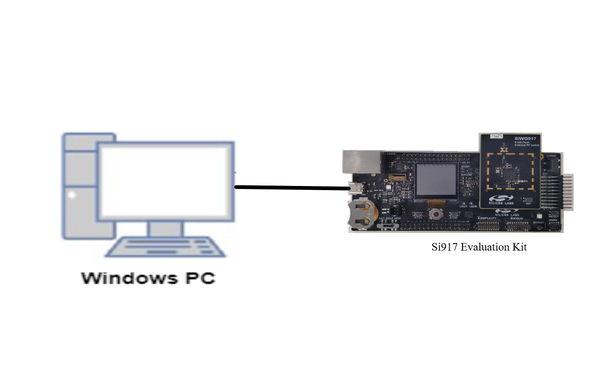

# SENSOR HUB

## Introduction 
- This application contains an example code to demonstrate the integration of Sensor Hub and its API usage and It is executing through the **RAM**. 
- It is a framework that can be easily integrated into any application where sensor handling is required. 
- The Sensor HUB works with sensors as per configurations provided by the application and notifies the necessary events throughout the application.
- The configuration for the sensors must be provided through the sensor hub config file on which the sensor hub should act. 
- The application demonstrates the sensor hub functionalities with the help of three I2C based sensors namely a BH1750 Light Sensor, LM75 Temperature Sensor, APDS9960 RGB Proximity Gesture sensor, 1 SPI based ADXL345 sensor, 1 ADC based Joystick Sensor and a GPIO based Push Button-0 as sensor and prints the data on Debug UART.
- The application also demonstrates the use of peripherals like I2C, SPI, GPIO, UART and ADC. 
- Sensor Hub relies on FreeRTOS using CMSIS RTOS version 2 wrapper.

## Features
- The sensor Hub demonstrates the power transition between PS4, PS2 and sleep states. ( Please refer to Section ***5.5.4 Power States*** in SiWx917_SoC_Datasheet_rev0.4_NDA for detailed information about Power Save modes).
- The application runs in PS4 state (Active mode) before switching to Power save modes. After switching to PS2 state, the sensor data will be sampled and collected.
- By default, Sensor Hub will operate at **20 MHz** core frequency in order to support PS2 State. This framework interfaces with peripherals using **ULP_GPIOs** since it must run in low power modes such as PS2 mode.
- ADXL345 sensor's maximum SPI clock speed is 5MHz.


## Framework


- Sensor Hub has 4 tasks: Application Task, Event Manager Task, Sensor Task and Power Manager Task
- The Application Task will create the sensor through API calls, or it will have handles over sensors using API calls. Handles like Create Sensor, Start Sensor, Stop Sensor, and Delete Sensor. At any given point in time App task can perform the above task.
- Event Manager Task deals with processing the events of Sensor Hub and notifying the Application.
- Sensor Task is mainly for handling the sensors. Like controlling the sensor, acquiring the data from the sensor, and posting the events to the Event Manager.
- Power Manager Task handles switching the power states 

## Setting Up 
 - To use this application following Hardware, Software and Project Setup are required

### Hardware Requirements	
  - Windows PC 
  - Silicon Labs [Si917 Evaluation Kit WPK BRD4002A + BRD4338A]
  - BH1750 Light Sensor
  - LM75 Temperature Sensor
  - APDS9960 RGB-Gesture-Proximity Sensor 
  - ADXL345 Accelerometer Sensor 



### Software Requirements
  - Si91x SDK
  - Embedded Development Environment
    - For Silicon Labs Si91x, use the latest version of Simplicity Studio (refer to **"Download and Install Simplicity Studio"** section in the **getting-started-with-siwx917-soc** guide at **release_package/docs/index.html**)
 
## Project Setup
- **Silicon Labs **Si91x** refer to **"Download**** SDKs"****, **"Add SDK to Simplicity Studio"**, **"Connect SiWx917**"**, and **"Open**** Example Project** in Simplicity Studio"** section in **getting-started-with-siwx917-soc** guide at **release_package/docs/index.html** to work with Si91x and Simplicity Studio

## Sensor Hub Configuration Parameters

* Configure the number of sensors info in the ***/sensors/inc/sensors_config.h** file
  ```C
  #define SL_MAX_NUM_SENSORS							5   // Maximum sensors present in the system
  ```

* Modes: Using the configuration structure, one can configure the following parameters in the ***sensorhub_config.c*** file:

  * For **POLLING Sensor Mode** configure the below parameters:
    ```C
      .sensor_mode                = SL_SH_POLLING_MODE,
      .sampling_interval          = 100, 
    ```
    * If sensor_mode is selected as ***SL_SH_POLLING_MODE***, then data_deliver.mode should be configured as **one** of the following for a sensor configuration structure: 
      * For **TIMEOUT Data Mode** configure the below parameters:
        ```C
        .data_deliver.mode          = SL_SH_TIMEOUT,  
        .data_deliver.timeout       = 1000,
        ```
      * For **THRESHOLD Data Mode** configure the below parameters:
        ```C
        .data_deliver.mode          = SL_SH_THRESHOLD,  
        .data_deliver.threshold     = 1000,
        ```
      * For **SAMPLING Data Mode** configure the below parameters:
        ```C
        .data_deliver.mode          = SL_SH_NUM_OF_SAMPLES,  
        .data_deliver.numOfSamples  = 5,
        ```

  * For **INTERRUPT Sensor Mode** configure the below parameters:
    ```C
      .sensor_mode                = SL_SH_INTERRUPT_MODE,
      .sampling_intr_req_pin      = BUTTON_0_GPIO_PIN, 
      .sensor_intr_type           = SL_SH_FALL_EDGE,
      .data_deliver.data_mode     = SL_SH_NO_DATA_MODE,
    ```
* To configure the PS2, please update the below macro in the preprocessor settings:
  ```C
  SL_SENSORHUB_POWERSAVE=1 
  //Enabling this macro will move the application from PS4 state to PS2 state. In PS2 state the sensor data will be sampled and collected.
  ```

* To configure the power states to PS4 sleep or PS2 Sleep, please update the defines in ***\gecko_sdk_4.3.2\util\third_party\freertos\kernel\include\FreeRTOS.h** file as below:
  ```C
  #ifndef configUSE_TICKLESS_IDLE
  #define configUSE_TICKLESS_IDLE 1           // 1 is to Enable the tickless Idle mode 
  #endif

  #ifndef configPRE_SLEEP_PROCESSING
  #define configPRE_SLEEP_PROCESSING(x) sli_si91x_sleep_wakeup(x)               // Here x is idle time, 
  #endif

  // Configure the sleep time by using the below macro. 
  // If the number of Ideal task ticks exceeds this value, the system is allowed to sleep.
  #ifndef configEXPECTED_IDLE_TIME_BEFORE_SLEEP
      #define configEXPECTED_IDLE_TIME_BEFORE_SLEEP    70
  #endif
  ```
    ***Note***: 
    * By using above sleep configuration, sensor hub is going to sleep by using the idle task and idle time.  
    * If the Ideal time exceeds the expected sleep time value, the system is allowed to sleep.
    * The above idle time is fed to the Alarm timer, which we are using as a wake-up source.

* **ADC Configurations**: 
Configure only below parameters for ADC to change its mode from FIFO to STATIC and vice versa

  * For ADC FIFO mode, configure as shown below:
  ```C
    .adc_config.adc_cfg.operation_mode        = SL_ADC_FIFO_MODE,
    .adc_config.adc_ch_cfg.sampling_rate[0]   = SL_SH_ADC_SAMPLING_RATE, // Use 100 for FIFO Mode
  ```
  * For ADC Static mode, configure as shown below:
  ```C
    .adc_config.adc_cfg.operation_mode        = SL_ADC_STATIC_MODE,
    .adc_config.adc_ch_cfg.sampling_rate[0]   = SL_SH_ADC_SAMPLING_RATE, // Use 1000 for Static Mode
  ```

## Sensor Pins Setup

### I2C Sensor Pin Configurations
| Sensor PIN | ULP GPIO PIN | Description |
| --- | --- | --- |
| SCL | ULP_GPIO_7 [EXP_HEADER-15] | Connect to SCL pin |
| SDA | ULP_GPIO_6 [EXP_HEADER-16] | Connect to SDA pin |
| VCC | (WPK) (3v3) | Connect to 3v3 pin |
| GND | (WPK) (GND) | Connect to GND pin |
| ADDR (for BH1750 Light Sensor) |(WPK) (GND) | Connect to GND pin |          
| 
### SPI Sensor Pin Configurations
| Sensor PIN | ULP GPIO PIN | Description |
| --- | --- | --- |
| MOSI | ULP_GPIO_1 [ F16/ P16 ] | Connect to SDA pin |
| MISO | ULP_GPIO_2 [ F10 ] | Connect to SDO pin |
| CLK | ULP_GPIO_8 | P15 |
| CS | ULP_GPIO_10 | P17 |
|
### ADC Sensor Pin Configurations
| Sensor PIN | ULP GPIO PIN | Description |
| --- | --- | --- |
| ADC Input | ULP_GPIO_10 [ P17 ] | Connect to Joystick output (P36)
| 


## Build 
- Compile the application in Simplicity Studio using the build icon 


## Device Programming
- To program the device,refer **"**Burn M4 Binary"** section in **getting-started-with-siwx917-soc** guide at **release_package/docs/index.html** to work with Si91x and Simplicity Studio

## Executing the Application
- Compile and run the application.
- Connect the I2C based sensors based on the above pin configuration.
- Connect the SPI based sensor based on the above pin configuration.

## Expected Results 
- The sensor events should be observed on the Serial Terminal as per the given configuration. 
- Button Zero is used for the interrupt mode. If you press the button zero on the base board we will get the "Button Sensor data Ready" print on the serial console and also Sensor data for which Interrupt mode is configured.

>### ***Note***: 
>#### General
  >- ADXL345 sensor will work only in PS4 state.
  >- ADC sensor will not work in Sleep state.
  >- Since ADC and SPI peripherals share ULP_GPIO_10, only one of them can operate at a time.
  >- The sensors in Interrupt Sensor Mode won't function in Sleep mode.
  >- In this framework, only one SPI sensor interface can be used.
>#### ADC 
  >- Use default configurations
  >- ADC static mode will read the data from the ADC registers and does not depends on ADC Interrupt.
  >- ADC static mode only supports Sensor Hub's Polling mode. And it will read 1 sample at a time based on the Sensor Hub Polling Sampling interval
  >- ADC FIFO mode will support Sensor Hub Polling and Interrupt Mode.


