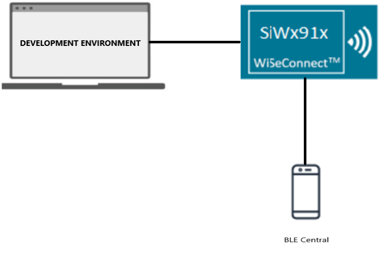
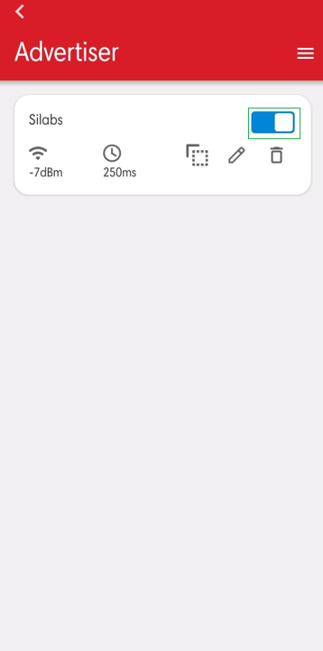
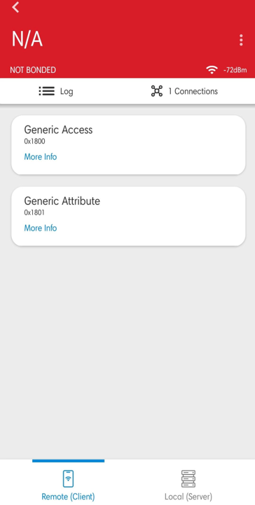
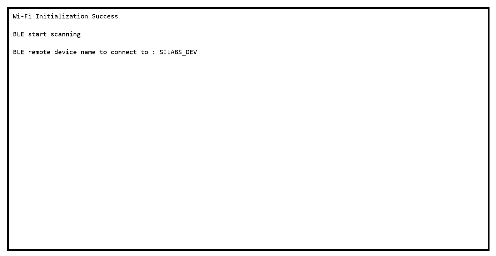

# BLE Accept List

## Table of Contents

- [Purpose/Scope](#purposescope) 
- [Prerequisites/Setup Requirements](#prerequisitessetup-requirements)
  - [Hardware Requirements](#hardware-requirements)
  - [Software Requirements](#software-requirements)
  - [Setup Diagram](#setup-diagram)
- [Getting Started](#getting-started)
- [Application Build Environment](#application-build-environment)
- [Test the Application](#test-the-application)

## Purpose/Scope

This application is used to add a particular BD-Address to the Accept List. The device to connect is saved on the Accept List located in the LL block of the controller.

This enumerates the remote devices that are allowed to communicate with the local device. The Accept List can restrict which device are allowed to connect to other device.

If it is not, it wont connect. Once the address was saved, the connection with that device is going to be an auto connection establishment procedure.

This means that the Controller autonomously establishes a connection with the device address that matches the address stored in the Accept List.

## Prerequisites/Setup Requirements

### Hardware Requirements

- Windows PC with Host interface(UART/ SPI/ SDIO).
  - SiWx91x Wi-Fi Evaluation Kit. The SiWx91x supports multiple operating modes. See [Operating Modes]() for details.
  - **SoC Mode**:
    - Silicon Labs [BRD4325A, BRD4325B, BRD4325C, BRD4325G, BRD4338A](https://www.silabs.com/)
  - **NCP Mode**:
    - Silicon Labs [BRD4180B](https://www.silabs.com/);
    - Host MCU Eval Kit. This example has been tested with:
      - Silicon Labs [WSTK + EFR32MG21](https://www.silabs.com/development-tools/wireless/efr32xg21-bluetooth-starter-kit)
- Smartphone configured as BLE central

### Software Requirements

- Simplicity Studio

### Setup Diagram


  
## Getting Started

Refer to the instructions [here](https://docs.silabs.com/wiseconnect/latest/wiseconnect-getting-started/) to:

- Install Studio and WiSeConnect 3 extension
- Connect your device to the computer
- Upgrade your connectivity firmware
- Create a Studio project

## Application Build Environment

The application can be configured to suit your requirements and development environment. Read through the following sections and make any changes needed.

- Open `app.c` file, and update/modify the below parameters

  - `RSI_BLE_DEV_ADDR_TYPE` refers address type of the remote device to connect.  

  ```c
    #define RSI_BLE_DEV_ADDR_TYPE                          LE_PUBLIC_ADDRESS 
  ```

  - Based on the address of the advertising device, Valid configurations are

      - LE_RANDOM_ADDRESS
      - LE_PUBLIC_ADDRESS

    > **Note:** Depends on the remote device, address type will be changed.

  - `RSI_BLE_DEV_ADDR` refers address of the remote device to connect.

  ```c
  #define RSI_BLE_DEV_ADDR                      "00:1A:7D:DA:71:48"
  ```

  - `RSI_BLE_ACCEPTLIST_DEV_ADDR1_TYPE`, `RSI_BLE_ACCEPTLIST_DEV_ADDR1_TYPE` refers address of the remote devices to be acceptlisted

  ```c
    #define RSI_BLE_ACCEPTLIST_DEV_ADDR1_TYPE              LE_PUBLIC_ADDRESS
    #define RSI_BLE_ACCEPTLIST_DEV_ADDR2_TYPE              LE_PUBLIC_ADDRESS
  ```
  
  - `RSI_REMOTE_DEVICE_NAME` refers the name of remote device to which Silicon Labs device has to connect.

  ```c
    #define RSI_REMOTE_DEVICE_NAME                         "SILABS_DEV" 
  ```

  > **Note:** user can configure either RSI_BLE_DEV_ADDR or RSI_REMOTE_DEVICE_NAME of the remote device.

  - Power save configuration

    - By default, The Application is configured without power save.

  ```c
    #define ENABLE_POWER_SAVE 0
  ```

    - If user wants to run the application in power save, modify the below configuration.

  ```c
    #define ENABLE_POWER_SAVE 1
  ```  

  - The desired parameters are provided below. User can also modify the parameters as per their needs and requirements.

  - Following are the event numbers for advertising, connection and Disconnection events,

  ```c
    #define RSI_APP_EVENT_ADV_REPORT                       0
    #define RSI_APP_EVENT_CONNECTED                        1
    #define RSI_APP_EVENT_DISCONNECTED                     2
  ```

- Open `ble_config.h` file and update/modify following macros,

  ```c
    #define RSI_BLE_PWR_INX                                30
    #define RSI_BLE_PWR_SAVE_OPTIONS                       0
    #define RSI_BLE_SCAN_FILTER_TYPE                       SCAN_FILTER_TYPE_ONLY_ACCEPT_LIST
  ```

  > **Note:**
   ble_config.h files are already set with desired configuration in respective example folders user need not change for each example.

## Test the Application

Refer to the instructions [here](https://docs.silabs.com/wiseconnect/latest/wiseconnect-getting-started/) to:

- Build the BLE – Acceptlist example in Studio.
- Flash, run and debug the application

Follow the steps as mentioned for the successful execution of the application:

1. Configure the remote ble device in peripheral mode and put it in advertising mode.

       

   > **Note:** Refer the [Creating New Advertisement Sets](https://docs.silabs.com/bluetooth/5.0/miscellaneous/mobile/efr-connect-mobile-app) for configuring the EFR connect mobile APP as advertiser.

2. After the program gets executed, it adds the configured remote device addresses to the acceptlist, and Silicon Labs device tries to connect only with the acceptlisted remote device specified in **RSI_BLE_DEV_ADDR or RSI_REMOTE_DEVICE_NAME** macro and ble_acceptlist_addr1 array.



3. Observe that the connection is established between the desired device and Silicon Labs device.

4. Refer the following ouput image:


