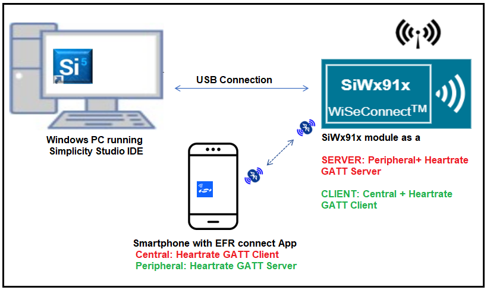
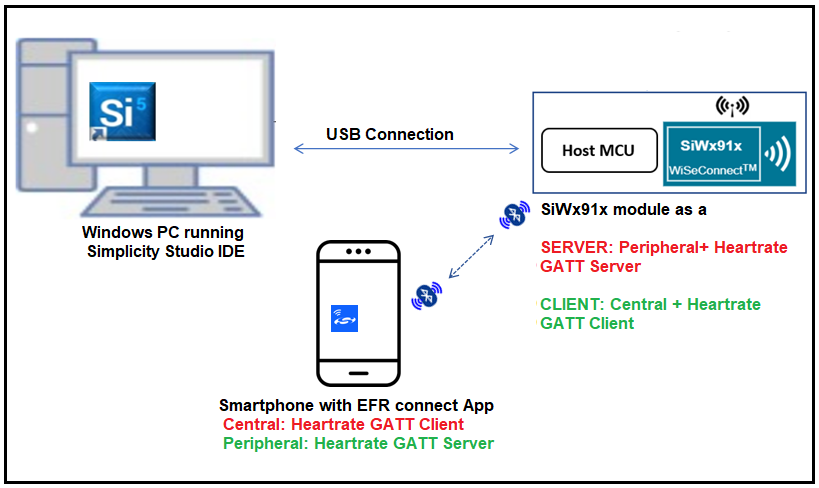
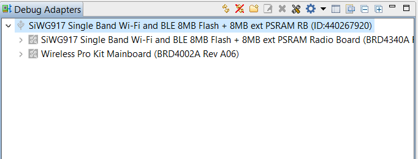
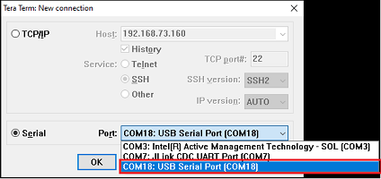
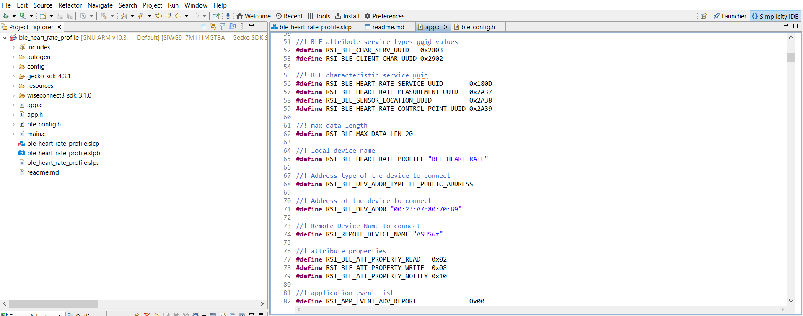
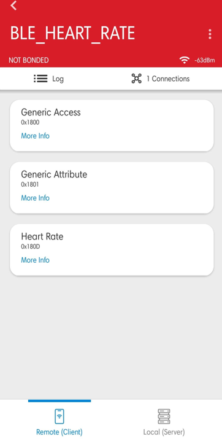
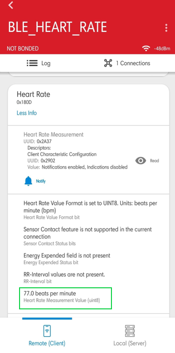
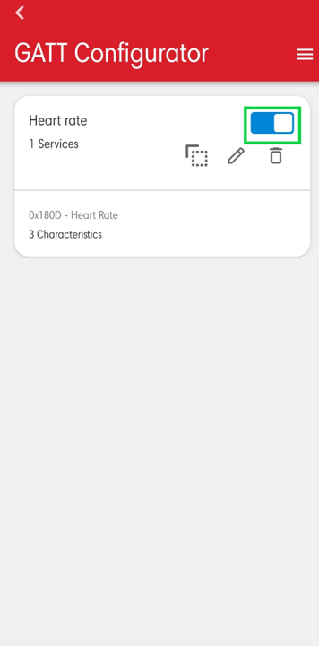
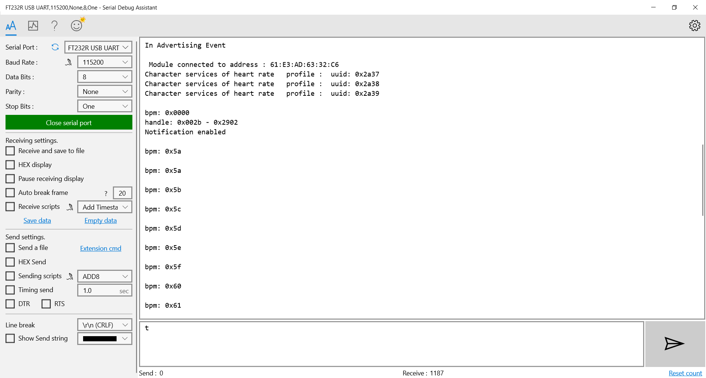

# BLE Heart Rate Profile

## 1. Purpose / Scope

This application demonstrates how to configure SiWx91x module as a GATT server with Heart Rate Service in BLE Peripheral Mode and explains how to do indicate operations with the GATT server from a connected remote device using the GATT client.

Also configure SiWx91x module as a GATT client in BLE central mode and enable indication of operation of the heart rate service of the connected remote GATT server from the GATT client. In the application,Heart rate GATT server is configured with heart rate service and their corresponding characteristic UUIDs.

When the connected remote device writes data to writable characteristic UUID, the WiseConnect device receives the data that is received on writable characteristic UUID and writes the same data to readable characteristic UUID and sends indications to the connected device (or) remote device can read the same data using read characteristic UUID if indication enabled on client side.

## 2. Prerequisites / Setup Requirements

Before running the application, the user will need the following things to setup.

### 2.1 Hardware Requirements

- Windows PC with Host interface(UART/ SPI/ SDIO).
  - SiWx91x Wi-Fi Evaluation Kit. The SiWx91x supports multiple operating modes. See [Operating Modes]() for details.
  - **SoC Mode**:
    - Silicon Labs [BRD4325A, BRD4325B, BRD4325C, BRD4338AS](https://www.silabs.com/)
  - **NCP Mode**:
    - Silicon Labs [BRD4180B](https://www.silabs.com/);
    - Host MCU Eval Kit. This example has been tested with:
      - Silicon Labs [WSTK + EFR32MG21](https://www.silabs.com/development-tools/wireless/efr32xg21-bluetooth-starter-kit)
  - **PSRAM Mode**:
    - Silicon Labs [BRD4340A](https://www.silabs.com/)
- BLE Smart Phone with GATT client

### 2.2 Software Requirements

- Embedded Development Environment
  - For Silicon Labs EFx32, use the latest version of [Simplicity Studio](https://www.silabs.com/developers/simplicity-studio)

- Download and install the Silicon Labs [EFR Connect App](https://www.silabs.com/developers/efr-connect-mobile-app) in the android smart phones for testing BLE applications. Users can also use their choice of BLE apps available in Android/iOS smart phones.

### 2.3 Setup Diagram

**SoC Mode / PSRAM Mode :**



**NCP Mode :**



Follow the [Getting Started with Wiseconnect3 SDK](https://docs.silabs.com/wiseconnect/latest/wiseconnect-getting-started/) guide to set up the hardware connections and Simplicity Studio IDE.

## 3 Project Environment

- Ensure the SiWx91x loaded with the latest firmware following the [Upgrade Si91x firmware](https://docs.silabs.com/wiseconnect/latest/wiseconnect-getting-started/getting-started-with-soc-mode#upgrade-si-wx91x-connectivity-firmware)

- Ensure the latest Gecko SDK along with the extension WiSeConnect3 is added to Simplicity Studio.

### 3.1 Creating the project

#### 3.1.1 SoC mode

- Ensure the SiWx91x set up is connected to your PC.

- In the Simplicity Studio IDE, the SiWx91x SoC board will be detected under **Debug Adapters** pane as shown below.

  ****

#### 3.1.2 NCP mode

- Ensure the EFx32 and SiWx91x set up is connected to your PC.

- In the Simplicity Studio IDE, the EFR32 board will be detected under **Debug Adapters** pane as shown below.

  ****

#### 3.1.3 PSRAM mode

- Ensure the SiWx91x set up is connected to your PC.

- In the Simplicity Studio IDE, the SiWx91x PSRAM board will be detected under **Debug Adapters** pane as shown below.

  ****


### 3.2 Importing the project

- Studio should detect your board. Your board will be shown here. Click on the board detected and go to **EXAMPLE PROJECTS & DEMOS** section 

#### SOC Mode

- Select **BLE - Heart Rate** test application

  ****

- Click 'Create'. The "New Project Wizard" window appears. Click 'Finish'

  ****

### 3.3 Set up for application prints

#### 3.3.1 Teraterm set up - for BRD4325A, BRD4325B, BRD4325C, BRD4325G

You can use either of the below USB to UART converters for application prints.

1. Set up using USB to UART converter board.

   - Connect Tx (Pin-6) to P27 on WSTK
   - Connect GND (Pin 8 or 10) to GND on WSTK

   ****

2. Set up using USB to UART converter cable.

   - Connect RX (Pin 5) of TTL convertor to P27 on WSTK
   - Connect GND (Pin1) of TTL convertor to GND on WSTK

   ****

3. Open the Teraterm tool.

   - For SoC mode, choose the serial port to which USB to UART converter is connected and click on **OK**.

     ****

**Note:** For Other 917 SoC boards please refer section #3.3.2

#### 3.3.2 **Teraterm set up - for NCP and SoC modes**

1. Open the Teraterm tool.

- choose the J-Link port and click on **OK**.
    
    ****

2. Navigate to the Setup → Serial port and update the baud rate to **115200** and click on **OK**.

    ****

    ****

## 4 Application Build Environment

### 4.1 Configure the Application
The application can be configured to suit your requirements and development environment. Read through the following sections and make any changes needed.

**4.1.1** In the Project explorer pane of the IDE, expand the **ble_heart_rate_profile** folder and open the **app.c** file. 


   - **GATT_ROLE** refers the role of the Silicon Labs module to be selected.
      - If user configures, **SERVER**, Silicon Labs module will act as GATT SERVER, means will add heart rate profile.

      - If user configures, **CLIENT**, Silicon Labs module will act as GATT CLIENT, means will connect to remote GATT server and get services and enable notify.
      
   ```c
   #define GATT_ROLE                  SERVER
   ```
   
   - **Power Save Configuration**
   Configure "ENABLE_POWER_SAVE" parameter to enable power save mode.
       
      ```c
         #define ENABLE_POWER_SAVE              1
      ```

**4.1.2 BLE Hear rate profile application as a SERVER**

- The following parameters are required to configure, when the SiWx91x module as a **SERVER**

  ```c
  //! RSI_BLE_HEART_RATE_PROFILE Refer to the SiWx91x module name
  #define RSI_BLE_HEART_RATE_PROFILE "BLE_HEART_RATE"

  //! BLE Heart rate service & characteristic service uuid
  #define RSI_BLE_HEART_RATE_SERVICE_UUID       0x180D
  #define RSI_BLE_HEART_RATE_MEASUREMENT_UUID   0x2A37
  #define RSI_BLE_SENSOR_LOCATION_UUID          0x2A38
  #define RSI_BLE_HEART_RATE_CONTROL_POINT_UUID 0x2A39

  //! BLE attribute service types uuid values
  #define RSI_BLE_CHAR_SERV_UUID   0x2803
  #define RSI_BLE_CLIENT_CHAR_UUID 0x2902

  //! attribute properties
  #define RSI_BLE_ATT_PROPERTY_READ   0x02
  #define RSI_BLE_ATT_PROPERTY_WRITE  0x08
  #define RSI_BLE_ATT_PROPERTY_NOTIFY 0x10
  ```

**4.1.3 BLE Hear rate profile application as a CLIENT**

- The following parameters are required to configure, when the SiWx91x module as a **CLIENT**

- **Remote device configuration parameters**

  ```c
  // RSI_BLE_DEV_ADDR_TYPE refers to the address type of the remote device to connect.
  //! Based on address type of remote device, valid configurations are LE_RANDOM_ADDRESS and LE_PUBLIC_ADDRESS
 
	#define RSI_BLE_DEV_ADDR_TYPE                          LE_PUBLIC_ADDRESS 
  
  //RSI_BLE_DEV_ADDR refers to the address of the remote device to connect.
  
  #define RSI_BLE_DEV_ADDR                               "00:23:A7:80:70:B9" 
  
  //RSI_REMOTE_DEVICE_NAME refers to the name of remote device to which Silicon Labs device has to connect.

   #define RSI_REMOTE_DEVICE_NAME                         "SILABS_DEV" 
  ```
  **Note:** you're required to configure either the `RSI_BLE_DEV_ADDR` or `RSI_REMOTE_DEVICE_NAME` of the remote device.

**4.1.4** Open `ble_config.h` file and configure required parameters as per requirement.
  

   - **Opermode command parameters**
  This configuration can be found in app.c as `config`	

      
 **Note:** `ble_config.h` and `app.c` files are already set with desired configuration in respective example folders you need not change for each example. 
	

### 4.2 Build the Application

- Follow the below steps for the successful execution of the application.

#### Build Project - SoC Mode / PSRAM Mode

- Once the project is created, click on the build icon (hammer) to build the project (or) right click on project and click on Build Project.

   

- Successful build output will show as below.

#### Build Project - NCP Mode

   

- Successful build output will show as below.

### 4.3 Run and Test the application

- Once the build was successfull, load the application image.

#### 4.3.1 Load the Application Image

1. Click on Tools and Simplicity Commander as shown below.

   

2. Load the firmware image

- Select the board.
- Browse the application image (.hex) and click on Flash button.

   

#### 4.3.2 Application Execution Flow

Application has the feasibility to configure the Heartrate GATT server (or) GATT client.     
**Note:**      
- The provided mobile screenshots are from the 2.5.2 version of the EFR Connect app, it is recommended to use the latest version.

#### BLE Hear rate profile application as a SERVER

1. After the program gets executed, If Silicon Labs device is configured as **SERVER** specified in the macro **GATT_ROLE**, Silicon Labs will be in Advertising state.

2. Connect any serial console for prints.

3. Open a EFR Connect App in the Smartphone and do the scan.

4. In the App, Silicon Labs module device will appear with the name configured in the macro `RSI_BLE_HEART_RATE_PROFILE (Ex: "BLE_HEART_RATE")` or sometimes observed as Silicon Labs device as internal name "**SimpleBLEPeripheral**".


5. Initiate connection from the App.

6. After successful connection, EFR Connect APP displays the supported services of Silicon Labs module.


7. Select the attribute service which is added `RSI_BLE_HEART_RATE_SERVICE_UUID`

8. Enable notify for the characteristic `RSI_BLE_HEART_RATE_MEASUREMENT_UUID`. So that GATT server indicates when value updated in that particular attribute.


9. Whenever the value is updated at server it will be notified to the client which can be read at Heart_Rate_Measurement attribute.


#### BLE Hear rate profile application as a CLIENT

1. Configure the **GATT_ROLE** macro as **CLIENT**

2. Connect any serial console for prints.

3. Open the EFR Connect APP and Create the **Hear rate service** to configure the Remote device as a GATT server.
   - Name: Heart Rate
   - UUID: 0x180D

   **Note:** Refer the [Adding Services](https://docs.silabs.com/bluetooth/5.0/miscellaneous/mobile/efr-connect-mobile-app) for creating the GATT server the EFR connect mobile APP as advertiser.
   

4. Add the characteristic services and their coresponding properties as shown below
   | S.No | Name | UUID | Property |
   |------|------|------|----------|
   |1|Heart Rate Measurement | 0x2A37 | Notify|
   |2|Body sensor Location | 0x2A38 | Read|
   |3|Heart Rate Control Point | 0x2A39 | Write|

   **Note:** Refer the [Adding Characteristics and Descriptors](https://docs.silabs.com/bluetooth/5.0/miscellaneous/mobile/efr-connect-mobile-app) for creating the GATT server in the EFR connect mobile APP.
   

5. Enable the **Heart rate** service.


6. Configure the advertiser.
      
**Note:** Refer the [Creating New Advertisement Sets](https://docs.silabs.com/bluetooth/5.0/miscellaneous/mobile/efr-connect-mobile-app) for configuring the EFR connect mobile APP as advertiser.

7. When Silicon Labs device is configured as **CLIENT** specified in the macro **GATT_ROLE**, scans for remote device and tries to connect with the remote device specified in `RSI_BLE_DEV_ADDR or RSI_REMOTE_DEVICE_NAME` macro.

8. Get all GATT profiles of remote device and Search for profile specified in the macro `RSI_BLE_HEART_RATE_SERVICE_UUID`. And get all characteristics of the heart rate service and verify the characteristic `RSI_BLE_HEART_RATE_MEASUREMENT_UUID` which has notify property.

9. Observe notify property is enabled in the GATT server and indicates to the GATT client whenever the value is updated at server .


10. Observe the updated heart rate measurement value on the serial terminal. Refer the below images for console prints

### 4.4 Application Output



