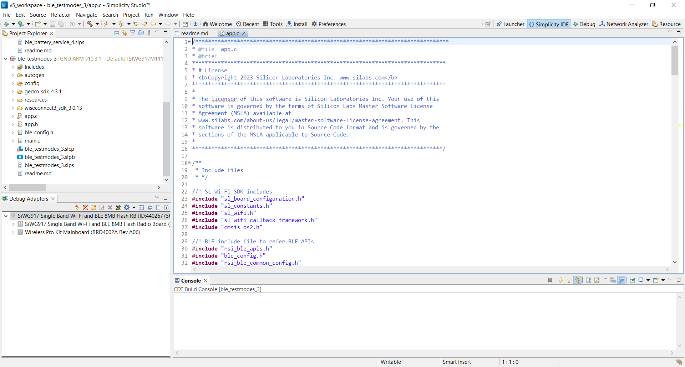
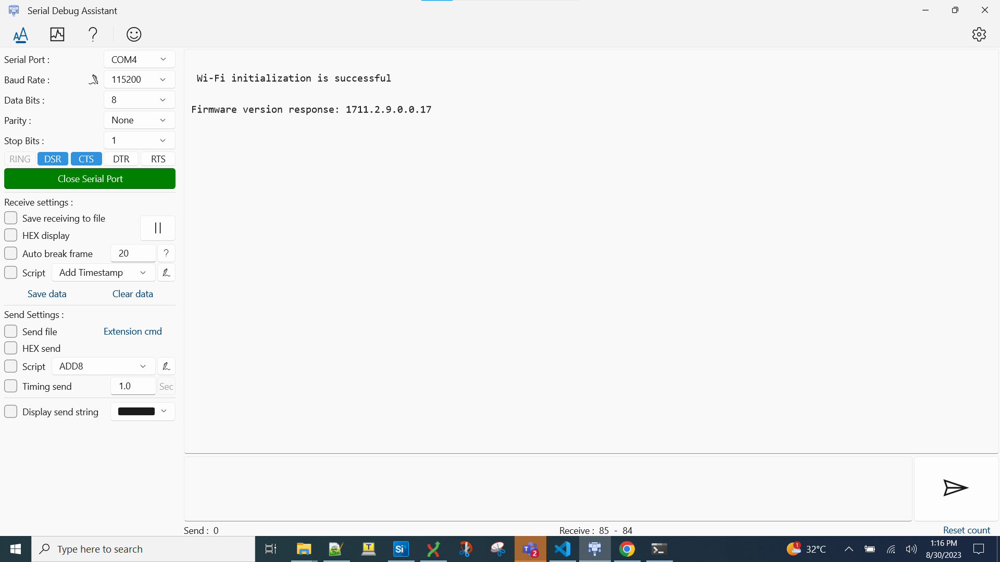
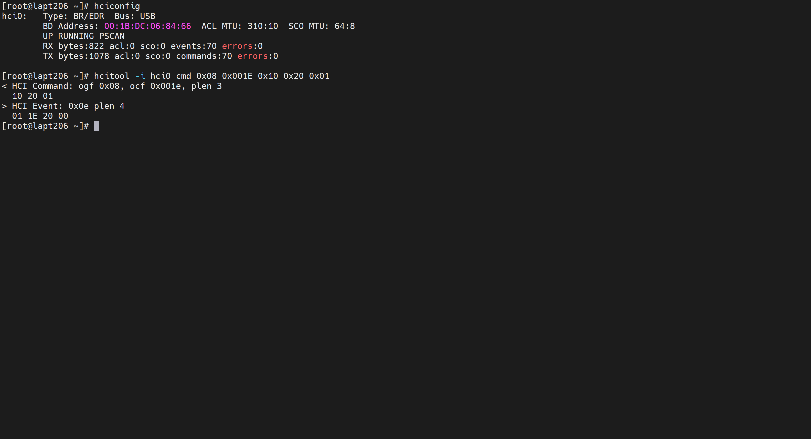

# BLE Test Modes

- [Purpose/Scope](#purposescope)
- [Prerequisites/Setup Requirements](#prerequisitessetup-requirements)
  - [Hardware Requirements](#hardware-requirements)
  - [Software Requirements](#software-requirements)
  - [Setup Diagram](#setup-diagram)
- [Getting Started](#getting-started)
- [Application Build Environment](#application-build-environment)
- [Test the Application](#test-the-application)
  - [TX Testmodes Execution](#tx-testmodes-execution)
  - [Configuring the Application for Rx](#configuring-the-application-for-rx)

## Purpose/Scope

This application demonstrates how to test the BLE GAP peripheral role.

## Prerequisites/Setup Requirements

### Hardware Requirements

- Windows PC
- SoC Mode:
  - Silicon Labs [BRD4325A, BRD4325B, BRD4325C, BRD4325G, BRD4338A](https://www.silabs.com/)
- NCP Mode:
  - Silicon Labs [BRD4180B](https://www.silabs.com/) **AND**
  - Host MCU Eval Kit. This example has been tested with:
    - Silicon Labs [WSTK + EFR32MG21](https://www.silabs.com/development-tools/wireless/efr32xg21-bluetooth-starter-kit)

- A Linux PC

- Third party Bluetooth dongle

### Software Requirements

- Simplicity Studio
- SoC
  - Silicon Labs SiWx917 PK6030A SoC Kit which includes
    - BRD4001A/BRD4002A Wireless Starter Kit Mainboard
    - BRD4325A Radio Board
  - USB TO UART converter / TTL cable
- NCP
  - Silicon Labs BRD8036A Si917 QMS SB Expansion Board
  - [Silicon Labs SLWSTK6006A EFR32xG21 Wireless Starter Kit](https://www.silabs.com/development-tools/wireless/efr32xg21-wireless-starter-kit) which includes
    - BRD4001A/BRD4002A Wireless Starter Kit Mainboard
    - BRD4180A/BRD4180B Radio Board

### Setup Diagram


  
## Getting Started

Refer to the instructions [here](https://docs.silabs.com/wiseconnect/latest/wiseconnect-getting-started/) to:

- Install Studio and WiSeConnect 3 extension
- Connect your device to the computer
- Upgrade your connectivity firmware
- Create a Studio project

## Application Build Environment

The application can be configured to suit user requirements and development environment. Read through the following sections and make any changes if needed.

> **Note:**
>
>For NCP mode, following defines have to enabled manually in preprocessor setting of example project
>
> - For 917 A0 expansion board, enable `CHIP_917 = 1`
> - For 917 B0 1.2 expansion board, enable `CHIP_917 = 1`, `CHIP_917B0 = 1`
> - For 917 B0 2.0 expansion board, enable `CHIP_917 = 1`, `CHIP_917B0 = 1`, `SI917_RADIO_BOARD_V2 = 1` (This is enabled by default for all examples)

1. In the Project Explorer pane of the IDE, expand the **ble_testmodes** folder and open the **app.c** file. 

   

   - **TX Testmodes configurations:** 

   ```c
   //RSI_CONFIG_TEST_MODE refers the Transmit Mode of the Silicon Labs module to be selected.
   #define RSI_CONFIG_TEST_MODE                          RSI_BLE_TESTMODE_TRANSMIT

   //RSI_BLE_TX_PAYLOAD_LEN refers the Transmit packet length.
   #define RSI_BLE_TX_PAYLOAD_LEN                        0x20

   //RSI_BLE_TX_PAYLOAD_TYPE refers the Transmit packet payload type
   #define RSI_BLE_TX_PAYLOAD_TYPE                       PRBS9_SEQ

   //RSI_SEL_ANTENNA refers the antenna which is to be used by Silicon Labs module, Valid configurations are RSI_SEL_INTERNAL_ANTENNA and RSI_SEL_EXTERNAL_ANTENNA
   #define RSI_SEL_ANTENNA                               RSI_SEL_INTERNAL_ANTENNA
   ```

   - **RX Testmodes configurations:** 

   ```c
   //RSI_CONFIG_TEST_MODE refers the Receive Mode of the Silicon Labs module to be selected.
   #define RSI_CONFIG_TEST_MODE                          RSI_BLE_TESTMODE_RECEIVE

   //RSI_SEL_ANTENNA refers the antenna which is to be used by Silicon Labs module, Valid configurations are RSI_SEL_INTERNAL_ANTENNA and RSI_SEL_EXTERNAL_ANTENNA
   #define RSI_SEL_ANTENNA                               RSI_SEL_INTERNAL_ANTENNA
   ```

## Test the Application

Refer to the instructions [here](https://docs.silabs.com/wiseconnect/latest/wiseconnect-getting-started/) to:

- Build the BLE - Testmodes(SOC) or BLE - Testmodes(NCP) example in Studio depending on your mode (SoC / NCP).
- Flash, run and debug the application



Follow the below steps for the successful execution of the application:

Application has the feasibility to configure the TX Testmodes (or) RX Testmodes.

### TX Testmodes Execution

1. Once the program is executed, the Silicon Labs module will begin transmitting packets with the desired length.
2. Attach the dongle to a Linux machine and execute the hcitool command.
3. Use the following command with the third-party dongle to verify whether the Silicon Labs module's packets are being transmitted:

   - `hcitool -i hcix cmd 0x08 0x001D 0x10` 

   (Replace hcix with the interface of the third-party dongle, and 0x10 with the received channel.)

4. The received channel of the third-party dongle should match the transmit channel of the Silicon Labs module.
5. To cease receiving, execute the following command using the third-party dongle.
 hcitool -i hcix cmd 0x08 0x001F
(Replace hcix with the interface of the third-party dongle.)
6. Verify the status parameters whether the packets are received or not after receiving stop command.
7. For reference, consult the provided images displaying prints from the third-party dongle.
8. Refer the below images for Third party dongle prints

   - commands log

   

   - bt mon log
      
   

### Configuring the Application for Rx

1. Once the program is executed, the Silicon Labs module will be ready to receive packets.
2. Utilize the following command with the third-party dongle to transmit packets to the Silicon Labs module.
3. Execute the command below using the third-party dongle to send packets to the Silicon Labs module:

   - hcitool -i hcix cmd 0x08 0x001E 0x10 0x20 0x01 
    
   (Replace hcix with the interface of the third-pa rty dongle, 0x10 with the received channel, 0x20 with the payload length, and 0x01 with the payload type.)

4. Received channel of Silicon Labs module should be same as transmit channel of Third party dongle.

5. Refer the below images for Third party dongle prints

- Command log:

   

- btmon log:

   
