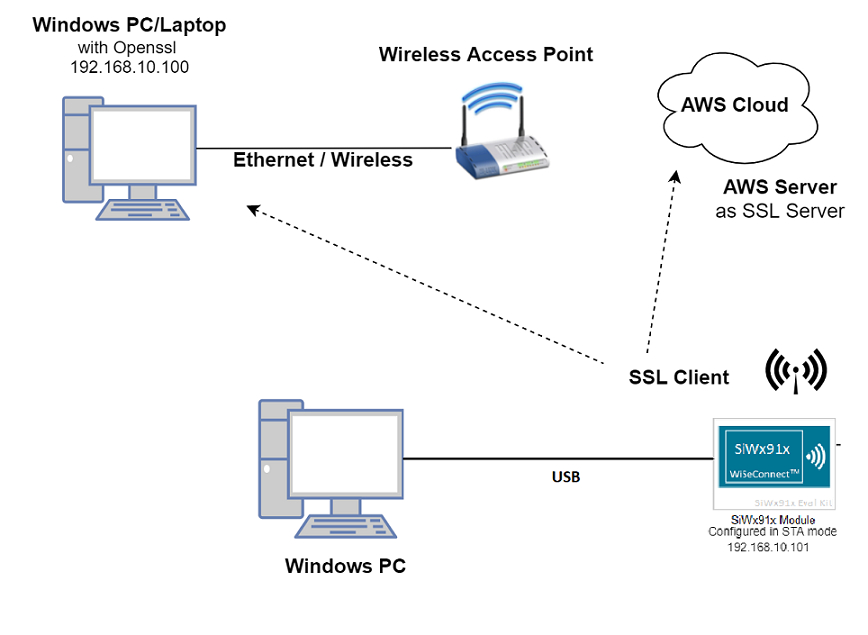
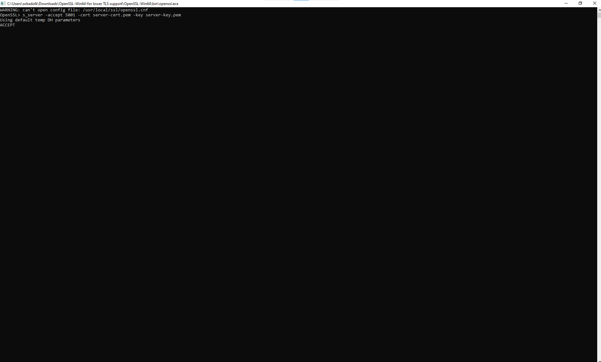
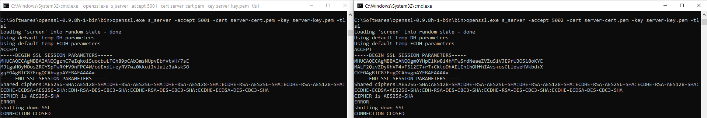
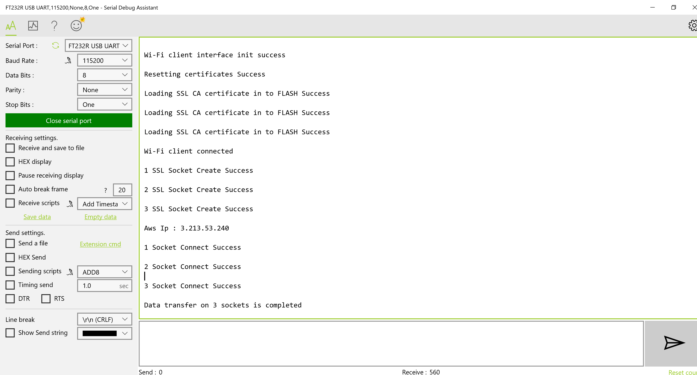

# Three SSL Client Sockets

## Table of Contents
- [Purpose/Scope](#purposescope)
- [Prerequisites/Set up Requirements](#prerequisitessetup-requirements)
  - [Hardware Requirements](#hardware-requirements)
  - [Software Requirements](#software-requirements)
  - [Setup Diagram](#setup-diagram)
- [Getting Started](#getting-started)
- [Application Build Environment](#application-build-environment)
- [Test the Application](#test-the-application)
  - [Build and Run the Server](#build-and-run-the-server)
  - [Run the Application](#run-the-application)

## Purpose/Scope

This application demonstrates how SiWx91x will connect to three different SSL servers with three different set of SSL certificates and loading certificates into the FLASH.

## Prerequisites/Set up Requirements

### Hardware Requirements

- Windows PC
- AWS server information like domain name running in the cloud which supports SSL connection.
- Wireless Access Point
- TCP server over SSL running in Windows PC (This application uses OpenSSL to create TCP server over SSL)
- SiWx91x Wi-Fi Evaluation Kit
- **SoC Mode**:
  - Silicon Labs [BRD4325A, BRD4325B, BRD4325C, BRD4325G, BRD4388A Radio Board](https://www.silabs.com/)
   - [BRD4002A Wireless Pro Kit Mainboard (WPK)](https://www.silabs.com/)
  
- **NCP Mode**:
    - [Silicon Labs SLWSTK6006A EFR32xG21 Wireless Starter Kit](https://www.silabs.com/development-tools/wireless/efr32xg21-wireless-starter-kit) which includes
      - BRD4001A Wireless Starter Kit Mainboard (WSTK)/BRD4002A Wireless Pro Kit Mainboard (WPK)
      - BRD4180A/BRD4180B Radio Board

### Software Requirements

- Simplicity Studio IDE

  - Download the latest [Simplicity Studio IDE](https://www.silabs.com/developers/simplicity-studio)
  - Follow the [Simplicity Studio user guide](https://docs.silabs.com/simplicity-studio-5-users-guide/1.1.0/ss-5-users-guide-getting-started/install-ss-5-and-software#install-ssv5) to install Simplicity Studio IDE

### Setup Diagram




## Getting Started

Refer to the instructions [here](https://docs.silabs.com/wiseconnect/latest/wiseconnect-getting-started/) to

- Install Studio and WiSeConnect 3 extension
- Connect your device to the computer
- Upgrade your connectivity firmware
- Create a Studio project
- Setup the console prints

## Application Build Environment
The application can be configured to suit your requirements and development environment.


> **Note:** For NCP mode, following defines has to be enabled manually in preprocessor settings of example project
>
> - For 917 A0 expansion board, enable `CHIP_917 = 1`
> - For 917 B0 1.2 expansion board, enable `CHIP_917 = 1`, `CHIP_917B0 = 1`
> - For 917 B0 2.0 expansion board, enable `CHIP_917 = 1`, `CHIP_917 B0 = 1`, `SI917_RADIO_BOARD_V2 = 1` (This is enabled by default for all examples)

### Wi-Fi Client Profile Configuration

In the Project Explorer pane, expand the config folder and open the **sl_net_default_values.h** file. Configure the following parameters to enable your Silicon Labs Wi-Fi device to connect to your Wi-Fi network

- **STA instance related parameters**

- DEFAULT_WIFI_CLIENT_PROFILE_SSID refers to the name with which Wi-Fi network that shall be advertised and Si91X module is connected to it.
	
  	```c
  	#define DEFAULT_WIFI_CLIENT_PROFILE_SSID               "YOUR_AP_SSID"      
  	```

	- DEFAULT_WIFI_CLIENT_CREDENTIAL refers to the secret key if the Access point is configured in WPA-PSK/WPA2-PSK security modes.

  	```c
  	#define DEFAULT_WIFI_CLIENT_CREDENTIAL                 "YOUR_AP_PASSPHRASE" 
  	```

	- DEFAULT_WIFI_CLIENT_SECURITY_TYPE refers to the security type of the Access point. The supported security modes are mentioned in `sl_wifi_security_t`.

  	```c
  	#define DEFAULT_WIFI_CLIENT_SECURITY_TYPE               SL_WIFI_WPA2
  	```
  
- Other STA instance configurations can be modified if required in `default_wifi_client_profile` configuration structure.

Configure the following parameters in **app.c** to test three_ssl_client_sockets app as per requirements  

```c
   #define SERVER_PORT1   <remote port>       // Remote server port
   #define SERVER_PORT2   <remote port>       // Remote server port cloud.
   #define SERVER_PORT3   <remote port>       //  remote peer/ which is running on cloud.   
   #define SERVER_ADDR    "192.168.1.108"     // Remote server IP address
```

If certificates are not there in flash, then ssl handshake will fail.
  
AWS_DOMAIN_NAME refers to domain name of the AWS server

```c
   #define AWS_DOMAIN_NAME   "a25jwtlmds8eip-ats.iot.us-east-2.amazonaws.com"
```

## Test the Application

### Build and Run the Server

Copy the certificates server-cert and server-key into Openssl/bin folder in the Windows PC (Remote PC)

**Note!**
 > All the certificates are given in the SDK. Path: `<SDK>/resources/certificates`

- In Windows PC (Remote PC) which is connected to AP, run the Openssl server by giving the following command

```sh
    > Openssl.exe s_server -accept<SERVER_PORT> -cert <server_certificate_file_path> -key <server_key_file_path> -tls<tls_version>

   Example: openssl.exe s_server -accept 5001 -cert server-cert.pem -key server-key.pem -tls1
```



### Run the application

Refer to the instructions [here](https://docs.silabs.com/wiseconnect/latest/wiseconnect-getting-started/) to

- Build the Wi-Fi - Three SSL client sockets example in Studio
- Flash, run and debug the application

After the program gets executed, SiWx91x would be connected to Access point having the configuration same that of in the application and get IP.

The Device which is configured as SSL client will connect to three different remote SSL servers.

 ****


****