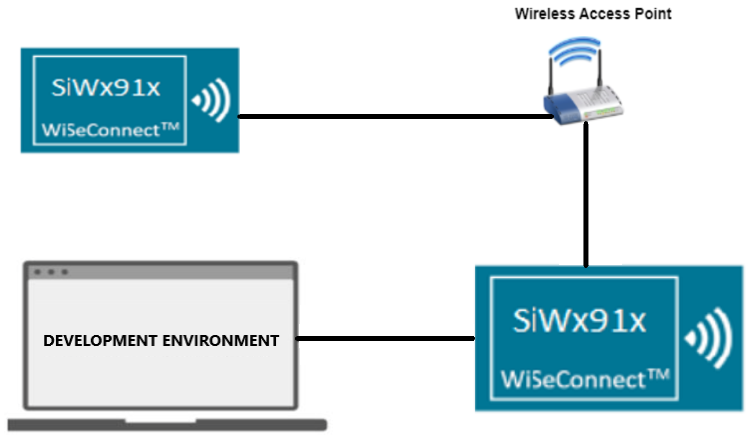
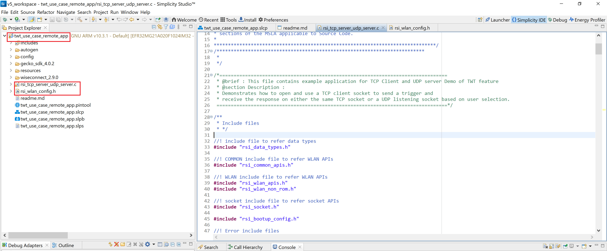
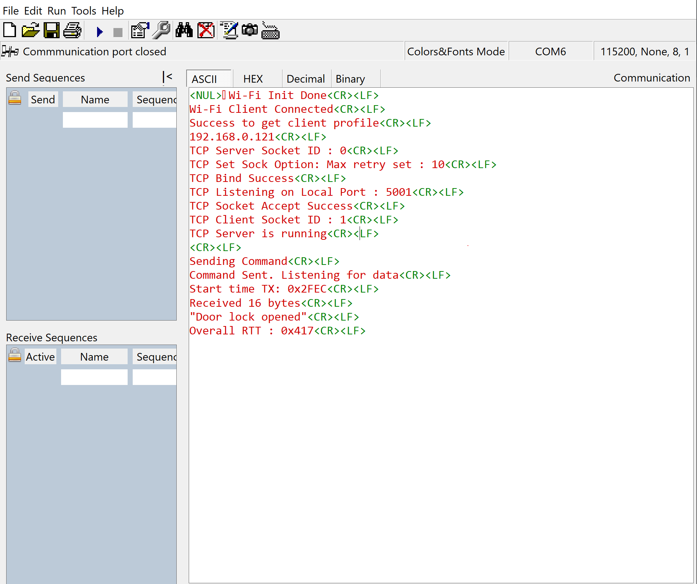

# TWT Use Case Remote App

- [Purpose/Scope](#purposescope) 
- [Prerequisites/Setup Requirements](#prerequisitessetup-requirements)
  - [Hardware Requirements](#hardware-requirements)
  - [Software Requirements](#software-requirements)
  - [Setup Diagram](#setup-diagram)
- [Getting Started](#getting-started)
- [Application Build Environment](#application-build-environment)
  - [Configure the Application](#configure-the-application)
  - [Application Configuration](#application-configuration)
- [Test the Application](#test-the-application)

## Purpose/Scope

The **TWT Use Case Remote App** application has TCP and UDP server sockets which sends a trigger over the TCP socket once a TCP client is connected and receives TCP Data in Door lock scenario and UDP Data in camera scenario..

## Prerequisites/Setup Requirements

### Hardware Requirements  

- PC or Mac.
- Linux PC or Cygwin on Windows (to build and run the TCP server source provided)
- Wi-Fi Access point with a connection to the internet
- **SoC Mode**:
  - Silicon Labs [BRD4325A, BRD4325B, BRD4325C, BRD4325G, BRD4338A](https://www.silabs.com/)
- **NCP Mode**:
  - Silicon Labs [BRD4180B](https://www.silabs.com/)
  - Host MCU Eval Kit. This example has been tested with:
    - Silicon Labs [WSTK + EFR32MG21](https://www.silabs.com/development-tools/wireless/efr32xg21-bluetooth-starter-kit)

### Software Requirements

- Simplicity Studio 
- [Iperf Application](https://iperf.fr/iperf-download.php)

### Setup Diagram

 

## Getting Started

Refer to the instructions [here](https://docs.silabs.com/wiseconnect/latest/wiseconnect-getting-started/) to:

- Install Studio and WiSeConnect 3 extension
- Connect your device to the computer
- Upgrade your connectivity firmware
- Create a Studio project

## Application Build Environment

The application can be configured to suit your requirements and development environment.

### Configure the Application

1. In the Project Explorer pane, expand the **config** folder and open the **sl_net_default_values.h** file. Configure the following parameters to enable your Silicon Labs Wi-Fi device to connect to your Wi-Fi network.

- **STA instance related parameters**

  - DEFAULT_WIFI_CLIENT_PROFILE_SSID refers to the name with which the SiWx91x SoftAP's Wi-Fi network shall be advertised.

     ```c
     #define DEFAULT_WIFI_CLIENT_PROFILE_SSID               "YOUR_AP_SSID"      
     ```

  - DEFAULT_WIFI_CLIENT_CREDENTIAL refers to the secret key if the Access point is configured in WPA-PSK/WPA2-PSK security modes.

     ```c 
     #define DEFAULT_WIFI_CLIENT_CREDENTIAL                 "YOUR_AP_PASSPHRASE" 
     ```

  - Other STA instance configurations can be modified if required in `default_wifi_client_profile` configuration structure.

### Application Configuration

Read through the following sections and make any changes needed.

This application is created to be used in combination with TWT Use Case Demo Application. These two applications simulate Door lock and Camera like scenarios.

This application can be used in combination with **TWT Use Case Remote App** Application. These two applications simulate Door lock and Camera like scenarios.

In Camera scenario, remote application (Device A) sends a command to the DUT (where TWT Use Case Application is running. Say Device B). Upon receiving the command (from Device A), DUT sends UDP data(equivalent to camera streaming) in response to the remote application's trigger.

In Door Lock scenario, upon receiving the command (from Device A), DUT (Device B) sends a TCP response (equivalent to door lock status response) to the remote application (Device B).

To support above scenarios, this app creates TCP server to listen for connections and trigger command (to device B) periodically. After transmitting the command, device A waits for TCP/UDP response based on the use case being executed.

Also on other end, device B is brought up as a TCP client. It also brings up UDP client in addition to TCP client if SEND_TCP_DATA macro is disabled.

This application also measures Round Trip Time (RTT) in milli seconds. It is calculated as the difference between the time the command is sent to the time the first response packet is received.
  
1. In the Project explorer pane of the IDE, expand the **twt_use_case_remote_app** folder and open the **app.c** file. Configure the following parameters based on your requirements.

   

- **STA instance related parameters**

- DEFAULT_WIFI_CLIENT_PROFILE_SSID refers to the name with which the SiWx91x SoftAP's Wi-Fi network shall be advertised.

  ```c
  #define DEFAULT_WIFI_CLIENT_PROFILE_SSID               "YOUR_AP_SSID"      
  ```

- DEFAULT_WIFI_CLIENT_CREDENTIAL refers to the secret key if the Access point is configured in WPA-PSK/WPA2-PSK security modes.

  ```c
  #define DEFAULT_WIFI_CLIENT_CREDENTIAL                 "YOUR_AP_PASSPHRASE" 
  ```

- DEFAULT_WIFI_CLIENT_SECURITY_TYPE refers to the security type of the Access point. The supported security modes are mentioned in `sl_wifi_security_t`.

  ```c
  #define DEFAULT_WIFI_CLIENT_SECURITY_TYPE SL_WIFI_WPA_WPA2_MIXED 
  ```

- Other STA instance configurations can be modified if required in `default_wifi_client_profile` configuration structure.

  > For Door lock scenario, enable TCP_RCV. The module sends trigger command every CMD_INTERVAL and receives TCP data on the same socket.

  > For Camera scenario, disable TCP_RCV. The module sends trigger command every CMD_INTERVAL and receives UDP data on the UDP server socket.

- CMD_INTERVAL is the interval between two successive trigger commands from the application. It is in milli seconds.

- **Client/Server IP Settings**

    ```c
    #define TCP_RCV 0

    //! Device TCP port number
    #define TCP_DEVICE_PORT 5001
    
    //! Device UDP port number
    #define UDP_DEVICE_PORT 5002
    
    //! Server port number
    #define SERVER_PORT 5001
    
    //! Server IP address. Should be in reverse long format
    #define SERVER_IP_ADDRESS "192.168.10.100"
    
    //! Number of packet to send or receive
    #define NUMBER_OF_PACKETS 1            
    ```

- **To configure IP address**: 

- DHCP_MODE refers whether IP address configured through DHCP or STATIC

  ```c
    //! Whether IP address is configured through DHCP or STATIC
    #define DHCP_MODE               1           
  ```

  > If user wants to configure STA IP address through DHCP then set DHCP_MODE to "1" and skip configuring the following DEVICE_IP, GATEWAY and NETMASK macros.
                                          (Or)
  > If user wants to configure STA IP address through STATIC then set DHCP_MODE macro to "0" and configure following DEVICE_IP, GATEWAY and NETMASK macros.

  ```c
      #define DEVICE_IP              "192.168.10.1"
      #define GATEWAY                "192.168.10.1"
      #define NETMASK                "255.255.255.0"
  ```

## Test the Application

Refer to the instructions [here](https://docs.silabs.com/wiseconnect/latest/wiseconnect-getting-started/) to:

- Build the Wi-Fi - TWT Use case remote app example in Studio.
- Flash, run and debug the application

Follow the steps below for successful execution of the application:

- After successful connection, module will be brought up as a TCP server socket, listens for TCP client and sends configured NUMBER_OF_PACKETS to TCP client (Si91x module with TWT enabled) or a UDP client.

    
