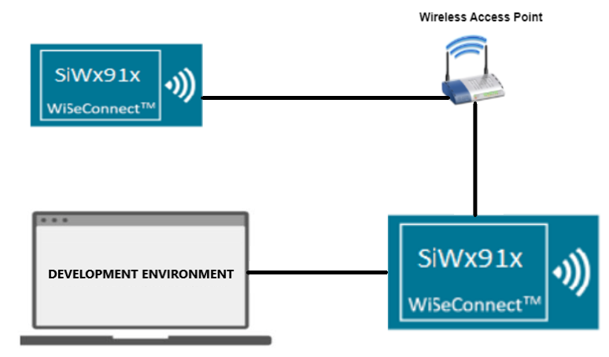
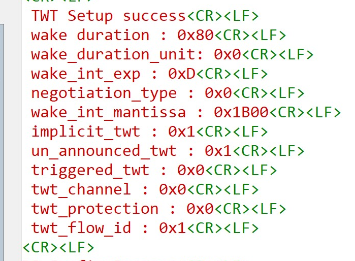
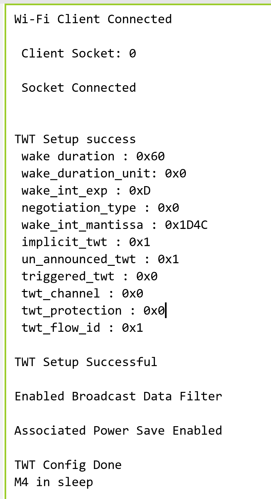

# TWT Use Case Demo

- [Purpose/Scope](#purposescope)
- [Prerequisites/Setup Requirements](#prerequisitessetup-requirements)
  - [Hardware Requirements](#hardware-requirements)
  - [Software Requirements](#software-requirements)
  - [Setup Diagram](#setup-diagram)
- [Getting Started](#getting-started)
- [Application Build Environment](#application-build-environment)
  - [Configure the Application](#configure-the-application)
  - [iTWT Configuration APIs](#itwt-configuration-apis)
    - [sl_wifi_target_wake_time_auto_selection API](#sl_wifi_target_wake_time_auto_selection-api)
    - [sl_wifi_enable_target_wake_time API](#sl_wifi_enable_target_wake_time-api)
  - [iTWT Teardown Configuration](#itwt-teardown-configuration)
  - [iTWT Command Status Codes](#itwt-command-status-codes)
  - [iTWT Session Status Codes](#itwt-session-status-codes)
  - [Recommendations](#recommendations)
- [Test the Application](#test-the-application)
  - [Using Simplicity Studio Energy Profiler for current measurement](#using-simplicity-studio-energy-profiler-for-current-measurement)
  - [Expected output in Energy Profiler](#expected-output-in-energy-profiler)

## Purpose/Scope

This application demonstrates the procedure to setup TWT session and configure the SiWx91x in TCP client role.

In this application, the SiWx91x connects to a Wi-Fi access point, obtains an IP address, connects to Iperf server running on a remote PC and maintains  TCP socket connection and periodically wakes up as per the configured TWT wakeup interval in powersave.

## Prerequisites/Setup Requirements

### Hardware Requirements  

- Windows PC
- Wi-Fi Access Point with 11ax and TWT responder mode support.
- PC2 (Remote PC) with TCP server application (iperf)
- **SoC Mode**:
  - Silicon Labs [BRD4325A, BRD4325B, BRD4325C, BRD4325G, BRD4388A](https://www.silabs.com/)
- **NCP Mode**:
  - Silicon Labs [BRD4180B](https://www.silabs.com/)
  - Host MCU Eval Kit. This example has been tested with Silicon Labs [WSTK + EFR32MG21](https://www.silabs.com/development-tools/wireless/efr32xg21-bluetooth-starter-kit) 

### Software Requirements

- Simplicity Studio IDE
- [Iperf Application](https://iperf.fr/iperf-download.php)

### Setup Diagram

  

## Getting Started

Refer to the instructions [here](https://docs.silabs.com/wiseconnect/latest/wiseconnect-getting-started/) to:

- Install Studio and WiSeConnect 3 extension
- Connect your device to the computer
- Upgrade your connectivity firmware
- Create a Studio project

## Application Build Environment

The application can be configured to suit your requirements and development environment.

### Configure the application

- Configure the SiWx91x as a TCP client and start a TCP server on the remote side APP. 
In general, it is advisable to start the server before the client since the client will immediately begin to try to connect to the server.

- In the Project explorer pane, expand the **config** folder and open the **sl_net_default_values.h** file. Configure the following parameters to enable your Silicon Labs Wi-Fi device to connect to your Wi-Fi network.

- **STA instance related parameters**

  - DEFAULT_WIFI_CLIENT_PROFILE_SSID refers to the name with which the SiWx91x SoftAP's Wi-Fi network shall be advertised.

     ```c
     #define DEFAULT_WIFI_CLIENT_PROFILE_SSID               "YOUR_AP_SSID"      
     ```

  - DEFAULT_WIFI_CLIENT_CREDENTIAL refers to the secret key if the Access point is configured in WPA-PSK/WPA2-PSK security modes.

     ```c 
     #define DEFAULT_WIFI_CLIENT_CREDENTIAL                 "YOUR_AP_PASSPHRASE" 
     ```

  - DEFAULT_WIFI_CLIENT_SECURITY_TYPE refers to the security type if the Access point is configured in WPA/WPA2 or mixed security modes.

    ```c
    #define DEFAULT_WIFI_CLIENT_SECURITY_TYPE              SL_WIFI_WPA2 
    ```

  - Other STA instance configurations can be modified if required in `default_wifi_client_profile` configuration structure.

- The application can be configured to suit your requirements and development environment.
Read through the following sections and make any changes needed. 

- This application can be used in combination with **TWT Use Case Remote App** Application. These two applications simulate Door lock and Camera like scenarios.

- In Camera scenario, remote application (Device A) sends a command to the DUT (where TWT Use Case Application is running. Say Device B). Upon receiving the command (from Device A), DUT sends UDP data(equivalent to camera streaming) in response to the remote application's trigger.

- In Door Lock scenario, upon receiving the command (from Device A), DUT (Device B) sends a TCP response (equivalent to door lock status response) to the remote application (Device B).

- To support above scenarios, this app brings up Si91x module as a TCP client. It also brings up UDP client in addition to TCP client if SEND_TCP_DATA macro is disabled.

- Also on other end, device A creates TCP server to listen for connections and trigger command (to device B) periodically. After transmitting command, device A waits for TCP/UDP response based on the use case being executed. Device B remains in sleep until it receives a command from the Remote Application (device A). 

- Number of packets to send or receive

  ```c
  #define NUMBER_OF_PACKETS 1
  ```

- TCP_SERVER_PORT port refers remote TCP server port number

  ```c
    #define TCP_SERVER_PORT 5001
  ```

- UDP_SERVER_PORT port refers remote UDP server port number

  ```c
  #define UDP_SERVER_PORT 5005
  ```

- SERVER_IP_ADDRESS_TCP refers remote peer IP address (Si91x remote module/ any end user application device IP) to connect with TCP server socket.

  ```c
  #define SERVER_IP_ADDRESS_TCP "192.168.50.68"
  ```

- SERVER_IP_ADDRESS_UDP refers remote peer IP address (Si91x remote module/ any end user application device IP) to connect with UDP server socket.

  ```c
  #define SERVER_IP_ADDRESS_UDP "192.168.50.136"
  ```

- For Doorlock scenario, enable **SEND_TCP_DATA** macro. In this mode, DUT is a TCP client that connects to the TCP server of the end user application and does TCP Tx on trigger.

- For Camera scenario, disable **SEND_TCP_DATA** macro. In this mode, DUT is a both a TCP client and a UDP client. TCP client, to receive command and a UDP client to send UDP data(camera streaming). 

  ```c
  #define SEND_TCP_DATA                             0
  ```

**Power save configuration**

- By default, the application is configured without power save. If user wants to run the application in power save, enable the below macro.

  ```c
  #define ENABLE_POWER_SAVE 1
  ```

> **Note:**
>
> - Once TWT SP started, beacon sync will happen as described below. This will be applicable till TWT teardown.
>   - Beacon sync will happen every 5 seconds if the TWT interval is less then 5 seconds. Else it will happen at 600ms before every TWT SP start.
> - Listen interval/DTIM skip/DTIM based sleep setting will not be applicable once TWT SP started. These settings will be applicable once TWT teardown is done.

- While editing the above mentioned parameters, Simplicity Studio shows a warning, click on the "Make a Copy" option and edit the above mentioned parameters

   

### iTWT Configuration APIs

There are 3 TWT configuration APIs. 

> - sl_wifi_target_wake_time_auto_selection - This API calculates and automatically configures TWT parameters based on the given inputs. Enables or disables a TWT session.
> - sl_wifi_enable_target_wake_time - Configures user given TWT parameters. Enables a TWT session.
> - sl_wifi_disable_target_wake_time - Disables a TWT session.

#### sl_wifi_target_wake_time_auto_selection API

```c
int32_t sl_wifi_target_wake_time_auto_selection(sl_wifi_twt_selection_t *twt_auto_request)
```

  Given below are sample configurations.

- Enable TWT_AUTO_CONFIG MACRO in the app.c file.

  ```c
  #define TWT_AUTO_CONFIG         1
  ```

- There are the default macro settings that are used for calculating the iTWT parameters. 

  ```c
  #define DEVICE_AVG_THROUGHPUT                20000    // KBPS
  #define ESTIMATE_EXTRA_WAKE_DURATION_PERCENT 0        // in percentage
  #define TWT_TOLERABLE_DEVIATION              10       // in percentage
  #define TWT_DEFAULT_WAKE_INTERVAL_MS         1024     // in milli seconds
  #define TWT_DEFAULT_WAKE_DURATION_MS         16       // in milli seconds
  #define MAX_TX_AND_RX_LATENCY_LIMIT          22118400 // 6hrs in milli seconds
  #define MAX_BEACON_WAKE_UP_AFTER_SP \
    2 // The number of beacons after the service period completion for which the module wakes up and listens for any pending RX.
  ```
  
  ```c
  sl_wifi_twt_selection_t default_twt_selection_configuration = {
    .twt_enable                            = 1,
    .average_tx_throughput                 = 1000,
    .tx_latency                            = 0,
    .rx_latency                            = 5000,
    .device_average_throughput             = DEVICE_AVERAGE_THROUGHPUT,
    .estimated_extra_wake_duration_percent = ESTIMATE_EXTRA_WAKE_DURATION_PERCENT,
    .twt_tolerable_deviation               = TWT_TOLERABLE_DEVIATION,
    .default_wake_interval_ms              = TWT_DEFAULT_WAKE_INTERVAL_MS,
    .default_minimum_wake_duration_ms      = TWT_DEFAULT_WAKE_DURATION_MS,
    .beacon_wake_up_count_after_sp         = MAX_BEACON_WAKE_UP_AFTER_SP
  };
  ```

  > Note :  WLAN Keep Alive should not be disabled while using this API.

#### sl_wifi_enable_target_wake_time API

  ```c
  sl_status_t sl_wifi_enable_target_wake_time(sl_wifi_twt_request_t *twt_req);
  ```

- iTWT parameters should be configured and filled into the *sl_wifi_twt_request_t* structure in app.c and passed as a parameter to *sl_wifi_enable_target_wake_time()* API.

  Given below are sample configurations.

  ```c
  sl_wifi_twt_request_t default_twt_setup_configuration = {
    .twt_enable              = 1,
    .twt_flow_id             = 1,
    .wake_duration           = 0x60,
    .wake_duration_unit      = 0,
    .wake_duration_tol       = 0x60,
    .wake_int_exp            = 13,
    .wake_int_exp_tol        = 13,
    .wake_int_mantissa       = 0x1D4C,
    .wake_int_mantissa_tol   = 0x1D4C,
    .implicit_twt            = 1,
    .un_announced_twt        = 1,
    .triggered_twt           = 0,
    .twt_channel             = 0,
    .twt_protection          = 0,
    .restrict_tx_outside_tsp = 1,
    .twt_retry_limit         = 6,
    .twt_retry_interval      = 10,
    .req_type                = 1,
    .negotiation_type        = 0,
  };
  ```

> Note:
>
> - TWT Wake duration depends on the wake duration unit. For example, for the above configuration, wake duration value is  (0xE0 * 256 = 57.3 msec).
> - TWT Wake interval is calculated as mantissa *2 ^ exp.  For example, for the above configuration, wake interval value is (0x1B00* 2^13  = 55.2 sec).
> - Configuring TWT Wake interval beyond 1 min might lead to disconnections from the AP.
> - There might be disconnections while using TWT with wake interval > 4sec when connected to an AP with non-zero GTK key renewal time.
> - Keep Alive timeout should be non-zero when negotiated TWT setup is **unannounced**, otherwise there might be disconnections.

- For both TWT APIs, if TWT session setup is successful, the following notification will be printed with TWT response parameters from the AP.

  

### iTWT Teardown Configuration

To teardown TWT session use the matching TWT API:

1. For TWT Auto Selection API :

- Set twt_enable parameter to 0 in the twt_selection structure. The other parameters are ignored. 

  ```c
  status = sl_wifi_target_wake_time_auto_selection(twt_selection);
  ```

2. For user given TWT parameters, call the API as follows:

    ```c
    status = sl_wifi_disable_target_wake_time(&twt_req);
    ```

- twt_req->twt_enable should be set to '0' for teardown operation.

- twt_req->twt_flow_id should be configured as described below: 

  > - This parameter range is from 0-7. It should be same as setup flow ID, otherwise error will be triggered.
  > - 0xFF - To teardown all active sessions. This value is valid only in case of teardown command.

- Rest of the parameters in the structure are ignored for a Teardown operation. 

  > Note : For setting a new TWT session, the existing TWT session must be teared down.

### iTWT Command Status Codes

- The following are the possible TWT command status codes.

  |S.No |MACRO  |Error code |Description| SAPI/WLAN error code|
  |:------:|:--------|:--------|:-----------------------------|:--------|
  |1.|TWT_SUPPORT_NOT_ENABLED_ERR|0x70|When HE_PARAMS_SUPPORT and TWT_SUPPORT macros are not enabled|FW|
  |2.|TWT_SETUP_ERR_SESSION_ACTIVE|0x71|Occurs when user tries to give TWT config command when there is an already active TWT session.|FW|
  |3.|TWT_TEARDOWN_ERR_FLOWID_NOT_MATCHED|0x72|Occurs when TWT teardown command is given with a flow ID that does not match existing session flow ID.|FW|
  |4.|TWT_TEARDOWN_ERR_NOACTIVE_SESS|0x73|Occurs when teardown command is given while there is no active session.|FW|
  |5.|TWT_SESSION_NOT_FEASIBLE|0x74|This error code indicates that TWT session is not feasible. It is thrown only when TWT Auto Selection API is used.|FW|

### iTWT Session Status Codes

- User can get asynchronous TWT session updates if *twt_response_handler* is defined and the callback is registered. A *twt_response_handler* is provided in the example application. The following are the TWT session status codes.

  |S.No|  MACRO|  Session status code|  Description|
  |:----|:------|:-------------------|:--------------|
  |1.|  TWT_SESSION_SUCC| 0|  TWT session setup success. TWT session is active.|
  |2.|  TWT_UNSOL_SESSION_SUCC| 1|  Unsolicited TWT setup response from AP accepted. TWT session is active.|
  |3.|  TWT_SETUP_AP_REJECTED|  4|  TWT Reject frame received in response for the sent TWT setup frame.|
  |4.|  TWT_SETUP_RSP_OUTOF_TOL|5|  TWT response parameters from AP for TWT Suggest request is not within tolerance set by User.|
  |5.|  TWT_SETUP_RSP_NOT_MATCHED|  6|  TWT response parameters from AP for TWT Demand request does not match parameters given by User.|
  |6.|  TWT_SETUP_UNSUPPORTED_RSP|  10| Unsupported TWT response from AP.|
  |7.|  TWT_TEARDOWN_SUCC|  11| TWT session teardown success|
  |8.|  TWT_AP_TEARDOWN_SUCC| 12| TWT session teardown from AP success|
  |9.|  TWT_SETUP_FAIL_MAX_RETRIES_REACHED| 15| TWT setup request retried maximum number of times as configured by user.|
  |10.| TWT_INACTIVE_DUETO_ROAMING| 16  |TWT session inactive due to roaming|
  |11.| TWT_INACTIVE_DUETO_DISCONNECT|  17| TWT session inactive due to disconnect|
  |12.| TWT_INACTIVE_NO_AP_SUPPORT| 18| TWT session inactive as connected AP does not support TWT.|

  > **Note:** The **twt_session_active** variable is provided in the example application and is updated according to the asynchronous TWT session notifications. User can utilize this variable to teardown or configure new session parameters depending upon existing session status. 

### Recommendations

1. Use sl_wifi_target_wake_time_auto_selection with appropriate Rx Latency input according to the user scenario as it has improved  design over sl_wifi_enable_target_wake_time, handles Embedded MQTT level disconnections and has better user interface.

2. iTWT setup is recommended after IP assignment/TCP connection/application connection.

3. When using sl_wifi_target_wake_time_auto_selection API, increase TCP / ARP Timeouts at remote side depending upon the configured Rx Latency.

4. When using sl_wifi_enable_target_wake_time, increase TCP / ARP Timeouts at remote side depending upon the configured TWT interval configured.

5. For iTWT GTK Interval Should be kept max possible value or zero. If GTK interval is not configurable, recommended TWT interval (in case of sl_wifi_enable_target_wake_time) / RX Latency (in case of sl_wifi_target_wake_time_auto_selection API) is less than 4sec.

6. When sl_wifi_enable_target_wake_time API is used, configuring TWT Wake interval beyond 1 min might lead to disconnections from the AP. Recommended to use TWT wake up interval less than or equal to 1 min.

7. WLAN Keep Alive timeout should not be disabled when sl_wifi_target_wake_time_auto_selection API is used or when unannounced TWT session is set up using sl_wifi_enable_target_wake_time API. It is recommended to use WLAN Keep Alive timeout of 30 sec.

## Test the application

Refer to the instructions [here](https://docs.silabs.com/wiseconnect/latest/wiseconnect-getting-started/) to:

- Build the Wi-Fi - TWT Use case demo app example in Studio.

- Flash, run and debug the application

  > **Note:**
  > If using **app.c** and using an iperf server on remote side, to avoid loss of TCP connection due to ARP loss while the device is in sleep, it is suggested to add the device IP address to the Remote PC's ARP table.
  > For example, for device IP "192.168.0.101", MAC address "80-C9-55-XX-XX-XX" and ethernet interface 7, following is the command used in a Windows system. The MAC address and IP of SiWx917 can be observed in the serial prints.  

- For Ethernet:

  ```sh
  netsh interface ipv4 set neighbors interface="Ethernet 7" "192.168.0.101" "80-c9-55-XX-XX-XX"
  ```

- For Wi-Fi:

  ```c
  netsh interface ipv4 set neighbors interface="Wi-Fi" "192.168.0.101" "80-c9-55-XX-XX-XX"
  ```

- For sl_wifi_target_wake_time_auto_selection API

  

### Using Simplicity Studio Energy Profiler for current measurement
  
  After flashing the application code to the module. Energy profiler can be used for current consumption measurements.

- From tools, choose Energy Profiler and click "OK"

  

- From Quick Access, choose Start Energy Capture option 

  

#### Expected output in Energy Profiler 
  
  

> **Note**: The average current consumption may vary based on the environment, the above image is for reference.
