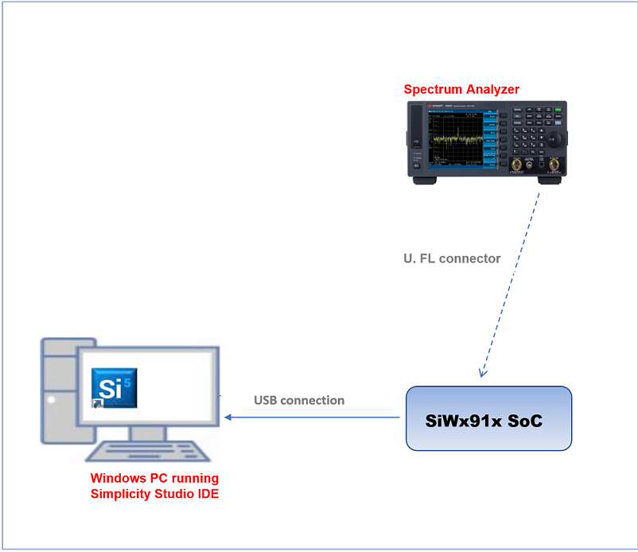
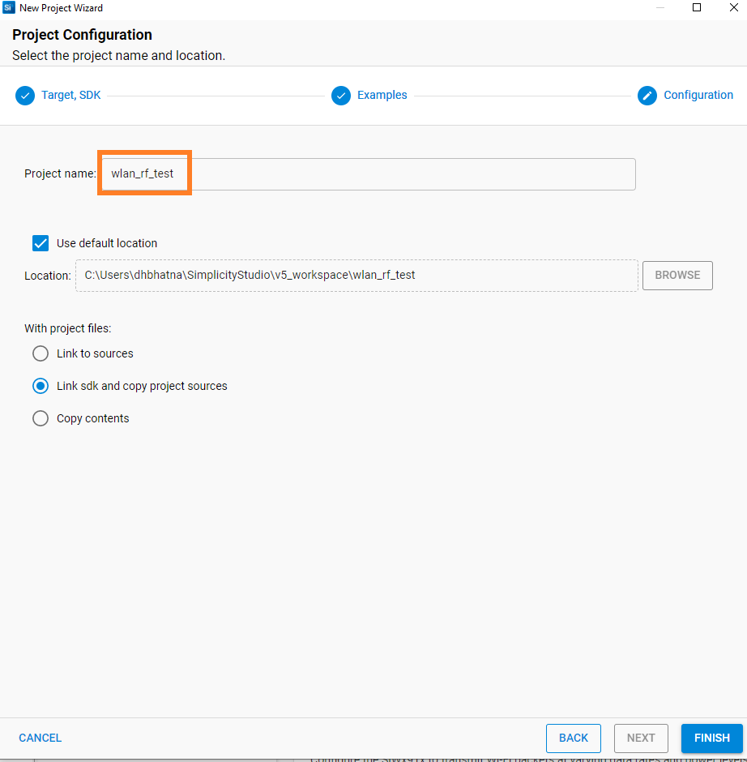
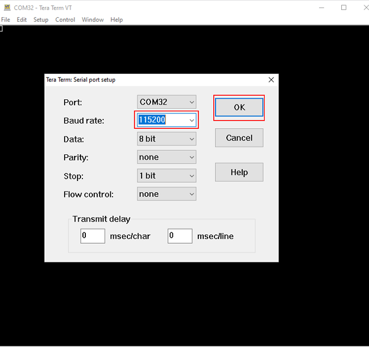
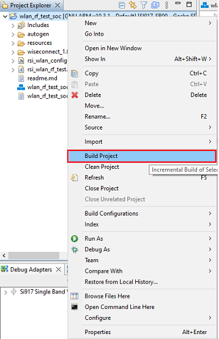
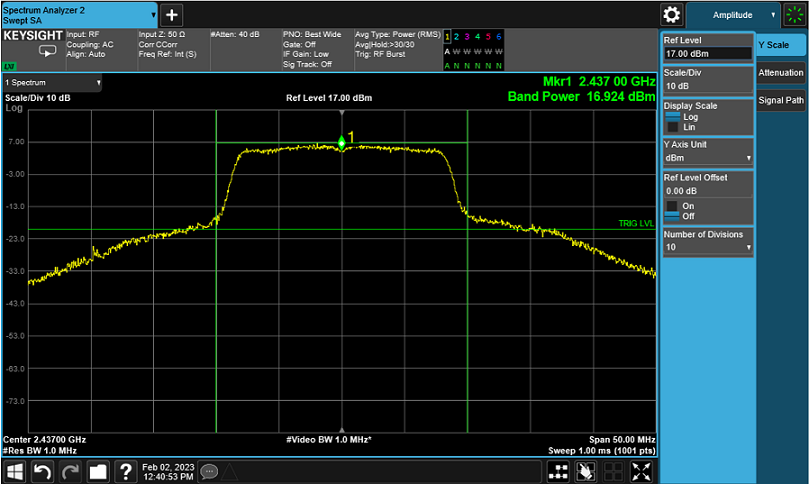

# WLAN RF Test

## 1 Purpose/Scope

This application demonstrates how to configure the SiWx91x to transmit Wi-Fi packets at varying data rates and power levels. The application can be used to assist with regulatory certification testing. 

## 2 Prerequisites/Setup Requirements

To use this application, the following hardware, software and project setup is required.

### 2.1 Hardware Requirements

- Windows PC.
- Spectrum Analyzer and RF connector
- Signal Generator and RF connectors
- SiWx91x Wi-Fi Evaluation Kit
  - **SoC Mode**:
    - Silicon Labs [BRD4325A, BRD4325B, BRD4325C, BRD4325G, BRD4388A, BRD4340A](https://www.silabs.com/)
  - **NCP Mode**:
    - Silicon Labs [BRD4180B](https://www.silabs.com/)
    - Host MCU Eval Kit. This example has been tested with:
      - Silicon Labs [WSTK + EFR32MG21](https://www.silabs.com/development-tools/wireless/efr32xg21-bluetooth-starter-kit)

### 2.2 Software Requirements

- Simplicity Studio IDE

  - Download the latest [Simplicity Studio IDE](https://www.silabs.com/developers/simplicity-studio)
  - Follow the [Simplicity Studio user guide](https://docs.silabs.com/simplicity-studio-5-users-guide/1.1.0/ss-5-users-guide-getting-started/install-ss-5-and-software#install-ssv5) to install Simplicity Studio IDE

### 2.3 Setup Diagram

#### Soc Mode



#### NCP Mode  


Follow the [Getting Started with Wiseconnect3 SDK](https://docs.silabs.com/wiseconnect/latest/wiseconnect-getting-started/) guide to set up the hardware connections and Simplicity Studio IDE.

## 3 Project Environment

- Ensure the SiWx91x loaded with the latest firmware following the [Upgrade Si91x firmware](https://docs.silabs.com/wiseconnect/latest/wiseconnect-getting-started/getting-started-with-soc-mode#upgrade-si-wx91x-connectivity-firmware)

- Ensure the latest Gecko SDK along with the extension WiSeConnect3 is added to Simplicity Studio.

### 3.1 Creating the project

#### 3.1.1 SoC mode

- Ensure the SiWx91x set up is connected to your PC.

- In the Simplicity Studio IDE, the SiWx91x SoC board will be detected under **Debug Adapters** pane as shown below.

  ****

#### 3.1.2 NCP mode

- Ensure the EFx32 and SiWx91x set up is connected to your PC.

- In the Simplicity Studio IDE, the EFR32 board will be detected under **Debug Adapters** pane as shown below.

  ****

### 3.2 Importing the project

- Studio should detect your board. Your board will be shown here. Click on the board detected and go to **EXAMPLE PROJECTS & DEMOS** section 

#### SOC Mode

- Select **Wi-Fi - Wlan RF Test** test application

  ****

- Click 'Create'. The "New Project Wizard" window appears. Click 'Finish'

  ****


### 3.3 Set up for application prints

#### 3.3.1 Teraterm set up - for BRD4325A, BRD4325B, BRD4325C, BRD4325G, BRD4340A

You can use either of the below USB to UART converters for application prints.

1. Set up using USB to UART converter board.

   - Connect Tx (Pin-6) to P27 on WSTK
   - Connect GND (Pin 8 or 10) to GND on WSTK

   ****

2. Set up using USB to UART converter cable.

   - Connect RX (Pin 5) of TTL convertor to P27 on WSTK
   - Connect GND (Pin1) of TTL convertor to GND on WSTK

   ****

3. Open the Teraterm tool.

   - For SoC mode, choose the serial port to which USB to UART converter is connected and click on **OK**.

     ****

**Note:** For Other 917 SoC boards please refer section #3.3.2

#### 3.3.2 **Teraterm set up - for NCP and SoC modes**

1. Open the Teraterm tool.

- choose the J-Link port and click on **OK**.
    
    ****

2. Navigate to the Setup → Serial port and update the baud rate to **115200** and click on **OK**.

    ****

    ****

## 4 Application Build Environment

### 4.1 Configure the application

The application can be configured to suit user requirements and development environment. Read through the following sections and make any changes needed.

1. Configure the following parameters in **app.c** to test rf_test app as per requirements

```c
  sl_wifi_data_rate_t rate = SL_WIFI_DATA_RATE_6;
  sl_si91x_request_tx_test_info_t tx_test_info = {
    .enable      = 1,          // Enable/disable tx test mode
    .power       = 4,         // Tx RF power in the range [2:18] dBm
    .rate        = rate,      // WLAN data rate of 6Mbps
    .length      = 30,        // Tx packet length in the range [24:1500] bytes in burst mode, 
    .mode        = 0,         // Selects burst mode or continuous mode
    .channel     = 1,         // Channel number in 2.4 or 5 GHz
    // Other configurable parameters
  }
```

    The different values of mode:
      0 - Burst Mode
      1 - Continuous Mode
      2 - Continuous wave Mode (non modulation) in DC mode
      3 - Continuous wave Mode (non modulation) in single tone mode (center frequency -2.5MHz)
      4 - Continuous wave Mode (non modulation) in single tone mode (center frequency +5MHz)

 2. In the Project explorer pane, expand as follows **wiseconnect3_sdk_xxx** > **components** > **si91x** > **inc** folder and open **sl_wifi_device.h** file. Change the region_code to the respective region in sl_wifi_transmit_test_configuration.

        region_code - US, EU, JP, WORLD_DOMAIN, KR

        Supported Channels in the specific regions
        US          -     1-11
        EUROPE      -     1-13
        JAPAN       -     1-14
        WORLD_DOMAIN-     1-14
        KOREA       -     1-13

    Note: Currently SG region is not supported.


### 4.2 Build the application

- SoC mode: Build as rf_test Example

    ****

- NCP mode:

    ****

### 4.3 Run and Test the application

1. Once the build was successful, right click on project and select Debug As → Silicon Labs ARM Program to program the device as shown in below image.

   ****

2. As soon as the debug process is completed, the application control branches to the main().

3. Click on the **Resume** icon in the Simplicity Studio IDE toolbar to run the application.

   ****

When the application runs, the SiWx91x starts transmitting using the configuration settings. A power meter or spectrum analyzer may be used to monitor the RF output power and spectrum.

The following readme provides example spectrums when the SiWx91x is configured to transmit with the settings shown.

## Transmit Spectrum Example

```c 
  sl_wifi_data_rate_t rate = SL_WIFI_DATA_RATE_6;
  sl_si91x_request_tx_test_info_t tx_test_info = {
    .enable      = 1,
    .power       = 127,
    .rate        = rate,
    .length      = 100,
    .mode        = 1,     // Continuous Mode
    .channel     = 6,
    // Other configurable parameters
  }                  
```

The below result is for PER Mode with Channel '6' with 6 Mbps data rate and max 127 power index, in Continuous mode, OFDM modulation technique.


```c
  sl_wifi_data_rate_t rate = SL_WIFI_DATA_RATE_6;
  sl_si91x_request_tx_test_info_t tx_test_info = {
    .enable      = 1,
    .power       = 127,
    .rate        = rate,
    .length      = 1000,
    .mode        = 0,     // Burst Mode
    .channel     = 6,
    // Other configurable parameters
  }                    
```

The below result is for PER Mode with Channel '6' with 6 Mbps data rate and max 127 power index, in Burst mode, OFDM modulation technique.



    NOTE:
    Before starting CW mode, it is required to start Continuous mode with power and channel values which is intended to be used in CW mode as follows:
      Start Continuous mode with intended power value and channel value; pass any valid values for rate and length
      Stop Continuous mode
      Start CW mode.

### 4.4 Application Output

#### SoC and NCP mode

  

